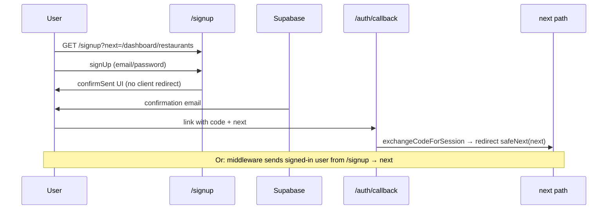

# Signup theme & redirect audit (prompt 63)

**Scope:** `/signup`, shared `AuthForm` (`sign_up`), `?next=` propagation, `/auth/callback`.  
**Out of scope:** Changing Supabase calls, middleware guards, `safeNextPath` rules, or callback exchange logic.

**Related:** Login chrome audit — [`AUTH_LOGIN_THEME_AUDIT.md`](./AUTH_LOGIN_THEME_AUDIT.md) (prompt 62 implemented shared `public-auth-*`).

---

## Styling

### Shared with `/login` (post–prompt 62)

| Piece | Status |
|-------|--------|
| `(auth)/layout.tsx` | Glass header, lavender `public-theme-canvas` wash |
| `AuthForm` panel / inputs / `public-btn-primary` | Same for `sign_in` and `sign_up` |
| Skeleton | `public-auth-panel--skeleton` on both pages |

`/signup` has **no page-specific layout** — only `app/(auth)/signup/page.tsx` wrapping `<AuthForm mode="sign_up" />`.

### Signup-specific UI (in `AuthForm`)

| Element | Current |
|---------|---------|
| Title | “Create your account” |
| Lead | “Start managing menus and phone orders in ROAL.” |
| Password placeholder | “At least 8 characters” |
| Submit | “Create account” |
| Footer link | “Sign in” → `/login?next=…` when `next !== "/dashboard"` |
| Post-submit | `confirmSent` panel — “Check your email” + “Back to sign in” |

**Verdict (theme):** Visually aligned with login. **Prompt 64** is polish (onboarding-oriented copy, optional signup-only eyebrow/metadata), not a second CSS pass.

### Minor theme gaps (64 / 65)

1. **No signup-only hero** — same density as login; launch plan wants “onboarding entry” feel (copy + optional `?next` hint in lead).
2. **Metadata** — `title: "Sign up — ROAL"` only; no description / canonical / OG (same gap as login pre-SEO pass).
3. **`confirmSent` panel** — styled like form; could add success tint or onboarding bullet list (cosmetic).
4. **`public-blog-link`** — present on footer; header Demo/Pricing shared.

---

## Redirect behavior (read-only audit)

### Flow diagram

### `?next=` parameter

| Source | Example `next` |
|--------|----------------|
| Default (missing param) | `/dashboard` via `safeNextPath(null)` |
| Contact self-serve CTA | `/dashboard/restaurants` |
| Home FAQ | `/dashboard/onboarding` |
| Middleware (guest → login) | Preserves full dashboard path + search |

**`safeNextPath`** (`lib/auth/safe-next.ts`): relative paths only; rejects `//`, `\`, `://`. **No open redirect.**

### After `signUp` (client)

- **Does not** `router.push(next)` on success.
- Sets `confirmSent = true` — correct when **email confirmation** is required.
- `emailRedirectTo`: `{origin}/auth/callback?next={encodeURIComponent(next)}` — confirm link lands on callback with same `next`.

**Dev note:** If Supabase Auth has **email confirm disabled**, Supabase may return a session immediately; UI still shows “Check your email” until refresh — behavior is project setting, not changed here.

### After email confirm (`GET /auth/callback`)

| Case | Redirect |
|------|----------|
| Missing `code` | `/login?error=Sign-in link expired…` |
| `exchangeCodeForSession` error | `/login?error={message}` |
| Success | `next` (default `/dashboard`) |

### Middleware (`lib/supabase/middleware.ts`)

| Condition | Behavior |
|-----------|----------|
| Guest hits `/dashboard/*` | → `/login?next={pathname+search}` |
| **Signed-in** hits `/login` or `/signup` | → `safeNextPath(?next)` (search cleared) |
| Protected API, no user | 401 JSON |

**Signup redirect QA:** Logged-in user visiting `/signup?next=/dashboard/restaurants` should land on `/dashboard/restaurants` without seeing the form.

### Link preservation

| Link | Preserves `next`? |
|------|-------------------|
| Signup footer → login | Yes, when `next !== "/dashboard"` |
| confirmSent → login | Yes, same rule |
| Login footer → signup | Yes, same rule |

When `next` is default `/dashboard`, links are bare `/login` and `/signup` (no query) — still valid.

### Inbound marketing CTAs

| CTA | Href | Post-auth destination |
|-----|------|------------------------|
| Demo / chapters | `/signup` | `/dashboard` |
| Contact / footer | `/signup?next=/dashboard/restaurants` | Restaurants list |
| Home FAQ | `/signup?next=/dashboard/onboarding` | Onboarding wizard |

**Gap (product, not auth logic):** Many CTAs use plain `/signup` — intentional default dashboard, not restaurants/onboarding. **Prompt 65** may unify copy; **not** a broken redirect.

---

## Auth logic boundary (unchanged in 64)

Do **not** modify:

- `supabase.auth.signUp` / `signInWithPassword`
- `emailRedirectTo` URL shape
- `confirmSent` branch conditions
- `middleware` `AUTH_PATHS` redirect
- `auth/callback/route.ts` exchange

Safe in **64 / 65 / 66:** classNames, copy strings, metadata, optional signup page wrapper.

---

## Manual QA checklist

| # | Step | Expected |
|---|------|----------|
| 1 | Open `/signup` logged out | Glass panel, lavender wash, black CTA |
| 2 | Open `/signup?next=/dashboard/onboarding` | Same UI; URL keeps query |
| 3 | Submit invalid email | Inline error, no navigation |
| 4 | Submit valid sign-up (dev) | “Check your email” panel; no dashboard yet |
| 5 | Confirm email link | Lands on `next` path with session |
| 6 | Visit `/signup` while logged in | Redirect to `next` or `/dashboard` |
| 7 | From confirm panel, “Back to sign in” | `/login?next=…` preserved when non-default |
| 8 | Mobile 320px | No horizontal overflow |

---

## File map

| File | Role |
|------|------|
| `app/(auth)/signup/page.tsx` | Page shell + metadata |
| `components/auth/auth-form.tsx` | `sign_up` UI + redirects (client) |
| `app/(auth)/layout.tsx` | Shared theme |
| `app/auth/callback/route.ts` | Post-confirm redirect |
| `lib/auth/safe-next.ts` | `next` sanitization |
| `lib/supabase/middleware.ts` | Guest/signed-in route guards |

---

## Verdict

| Area | Status |
|------|--------|
| **Theme** | **OK** — inherits prompt 62 `public-auth-*`; 64 = onboarding copy/positioning |
| **Redirects** | **Sound** — `next` preserved through email confirm; middleware handles signed-in; no open redirect |
| **Risks** | Email-confirm-off dev UX; bare `/signup` → `/dashboard` not onboarding unless `?next=` set |

**Prompt 64:** Done — `SignupPageEntry` + onboarding aside, `SIGNUP_PAGE_COPY`, metadata, success panel tint.  
**Prompt 65–67:** Copy polish, a11y, smoke — separate.
