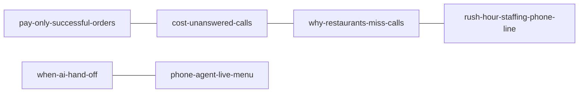

# Blog Content Audit — SEO / AEO / Copy Freshness

**Prompt 37** — audit only (no rewrites).  
**Scope:** 10 published posts in `lib/blog/posts/*.ts`, validated by `validate-aeo.ts` (3–5 FAQ, `answerShort` required).  
**Compared to:** `/pricing` copy (`$0.90` per successful order), `BLOG_CTA_*`, `docs/BLOG_CONTENT_PLAN.md`.

---

## Executive summary

| Signal | Status |
|--------|--------|
| AEO structure | **Pass** — all 10 have `answerShort`, 5 FAQs, unique questions |
| Technical SEO | **Pass** — per-post `seo.title` / `seo.description`, article OG via `buildBlogArticleMetadata` |
| Pricing alignment | **Gap** — **zero** posts mention `$0.90` or link to `/pricing` in body copy |
| Internal linking | **Gap** — no in-prose links between posts or to `/pricing`, `/demo`, `/contact` |
| Depth | **Split** — 6 posts ~600–820 words; 4 posts ~160–210 words (card-first, reads thin on article pages) |
| Cannibalization | **Risk** — `why-restaurants-miss-calls` vs `rush-hour-staffing-phone-line` overlap heavily |

**Top 6 to improve first** (maps to prompts 38–43):

1. `pay-only-successful-orders`
2. `cost-unanswered-restaurant-phone-calls`
3. `why-restaurants-miss-calls-dinner-rush`
4. `ai-phone-ordering-small-restaurants`
5. `rush-hour-staffing-phone-line`
6. `setup-roal-20-minutes`

---

## Scoring rubric (per post)

| Dimension | What we checked |
|-----------|-----------------|
| **SEO** | Title/description length, primary keyword in H2s, distinct slug intent |
| **AEO** | `answerShort` cite-worthiness, FAQ as real queries, section IDs for TOC |
| **Freshness** | Pilot/success pricing language vs `/pricing`; removed “Growth tier” etc. |
| **Depth** | Word count vs `readTimeMinutes`; plan target (full vs card-first) |
| **Conversion** | CTA preset (`demo` vs `menu`), pricing transparency |

---

## Post-by-post audit

### 1. `why-restaurants-miss-calls-dinner-rush` (featured)

| | |
|--|--|
| **Words / sections** | ~642 / 6 |
| **SEO** | Strong — “dinner rush”, “missed calls”, KDS in meta |
| **AEO** | Strong answer box; FAQ #3 points to cost post conceptually but no link |
| **Freshness** | “Success orders” OK; no `$0.90` |
| **Issues** | No internal links; overlaps post #8; example math could link to cost post |
| **Priority** | **P1** — prompt **38** |

---

### 2. `ai-phone-ordering-small-restaurants`

| | |
|--|--|
| **Words / sections** | ~724 / 8 |
| **SEO** | Good primary keyword coverage |
| **AEO** | Clear flow answer; FAQs are search-shaped |
| **Freshness** | OK |
| **Issues** | No link to live-menu or pricing posts; CTA demo-only |
| **Priority** | **P1** — prompt **39** |

---

### 3. `cost-unanswered-restaurant-phone-calls`

| | |
|--|--|
| **Words / sections** | ~820 / 8 |
| **SEO** | Best long-tail (“cost unanswered restaurant phone calls”) |
| **AEO** | Excellent worksheet framing + disclaimers |
| **Freshness** | Says “see pricing” in prose but not a URL; ROAL charge FAQ vague on rate |
| **Issues** | Missing `$0.90` anchor; no `/pricing` link; “contact us” without `hello@getroal.com` |
| **Priority** | **P1** — prompt **40** |

---

### 4. `restaurant-ai-voice-agent-sounds-human`

| | |
|--|--|
| **Words / sections** | ~638 / 8 |
| **SEO** | Solid |
| **AEO** | Good disclosure + handoff FAQ |
| **Issues** | Minor — cross-link handoff post in body; demo CTA only |
| **Priority** | **P2** — prompt **41** (after top 4) |

---

### 5. `phone-agent-must-know-live-menu`

| | |
|--|--|
| **Words / sections** | ~683 / 8 |
| **SEO** | Strong “live menu” cluster |
| **AEO** | Good; allergy FAQ aligns with handoff post |
| **Issues** | Uses `BLOG_CTA_MENU` (good); could link `setup-roal-20-minutes` |
| **Priority** | **P2** — prompt **42** |

---

### 6. `pay-only-successful-orders`

| | |
|--|--|
| **Words / sections** | ~627 / 8 |
| **SEO** | Pricing intent clear |
| **AEO** | FAQs good but **never state pilot rate** |
| **Freshness** | **Outdated:** “Tier names on the pricing page are guides” — `/pricing` now leads with single **$0.90** success rate, no Growth highlight |
| **Issues** | Highest pricing misalignment; no `/pricing` link; duplicate themes with post #3 |
| **Priority** | **P0** — fix before other pricing mentions |

---

### 7. `setup-roal-20-minutes`

| | |
|--|--|
| **Words / sections** | ~208 / 4 |
| **SEO** | Meta OK; body thin for “20 minutes” head term |
| **AEO** | Answer box good; FAQs carry most AEO weight |
| **Issues** | **Thin article** vs 4 min read time; no steps/screens; no pricing link |
| **Priority** | **P1** — expand sections + checklist (prompt **43** or bundled with 39) |

---

### 8. `rush-hour-staffing-phone-line`

| | |
|--|--|
| **Words / sections** | ~189 / 4 |
| **SEO** | Cannibalizes post #1 (“host/expo/phone”, same FAQ shape) |
| **AEO** | Adequate FAQs; answer box repeats post #1 thesis |
| **Issues** | **Thin**; needs distinct angle (labor $ vs AI $, shift roster) or merge into #1 |
| **Priority** | **P1** — differentiate or deepen |

---

### 9. `phone-orders-vs-delivery-apps`

| | |
|--|--|
| **Words / sections** | ~199 / 4 |
| **SEO** | DoorDash FAQ = good AEO; body needs 2–3 more sections |
| **Issues** | Thin; no illustrative margin example (labeled); no link to pay-only post |
| **Priority** | **P2** — phase 2 after top 6 |

---

### 10. `when-ai-should-hand-off-to-staff`

| | |
|--|--|
| **Words / sections** | ~164 / 4 |
| **SEO** | Good intent |
| **Issues** | **Thinnest**; allergy copy duplicates post #5; warm-transfer section could be scenarios |
| **Priority** | **P2** — expand with 2–3 scripted examples |

---

## Cross-cutting gaps

### Pricing & product copy

- **No post** states **`$0.90 per successful order`** (homepage/pricing canonical).
- **No markdown/HTML links** to `/pricing`, `/demo`, or `mailto:hello@getroal.com` in section paragraphs (only UI CTA at bottom).
- `pay-only-successful-orders` references **pricing tiers** that no longer match public pricing page.

### Internal linking (recommended pattern)

Add 1–2 plain-language links per full post, e.g.:

- Missed calls cluster → each other + `cost-unanswered…`
- Product posts → `phone-agent-must-know-live-menu`, `setup-roal-20-minutes`
- Pricing posts → `/pricing` + `pay-only-successful-orders`

Implementation note: sections are plain strings today — use relative paths in copy or a tiny `blogLink(slug)` helper later.

### Cannibalization map

**Fix:** Post #8 → staffing economics + hybrid roster; Post #1 → emotional/operational “why”; reduce shared FAQ wording.

### Read time vs depth

| Slug | Words | `readTimeMinutes` | Note |
|------|-------|-------------------|------|
| Thin quartet (#7–10) | 164–208 | 4–6 | Feels short for 5–6 min label |
| Full sextet (#1–6) | 627–820 | 5–8 | Aligned |

Consider lowering read time on thin posts **or** expanding to ~400+ words.

### CTAs

| CTA | Posts |
|-----|-------|
| `BLOG_CTA_DEMO` (`/demo`) | 8 posts |
| `BLOG_CTA_MENU` (`/signup`) | `setup-roal-20-minutes`, `phone-agent-must-know-live-menu` |

**Suggestion:** Pricing posts (#3, #6) → demo + “See pricing” in `cta.description`; setup/menu posts keep signup.

---

## Top 6 — why these, what to change

| Rank | Slug | Why top 6 | Rewrite focus |
|------|------|-----------|----------------|
| 1 | `pay-only-successful-orders` | Pricing pillar; **outdated tier copy**; no $0.90 | Mirror `/pricing` AEO; link `/pricing`; remove tier-name line; FAQ with rate |
| 2 | `cost-unanswered-restaurant-phone-calls` | High-intent SEO; ties to pricing | Keep illustrative math; add $0.90 + `/pricing`; mailto contact |
| 3 | `why-restaurants-miss-calls-dinner-rush` | Featured; funnel entry | Pain sharper; internal links; dedupe vs #8 |
| 4 | `ai-phone-ordering-small-restaurants` | Core product keyword | Restaurant vignettes; link menu + pricing posts |
| 5 | `rush-hour-staffing-phone-line` | Thin + cannibalizes #1 | Labor vs AI coverage angle; tables/checklist |
| 6 | `setup-roal-20-minutes` | Conversion path (`/signup` CTA) | Step list, time boxes, link live-menu post |

**Next tier (7–10):** `restaurant-ai-voice-agent-sounds-human`, `phone-agent-must-know-live-menu`, `phone-orders-vs-delivery-apps`, `when-ai-should-hand-off-to-staff`.

---

## AEO quick wins (all posts)

1. Add **one FAQ** on pricing posts: “How much does ROAL cost per order?” → cite **$0.90** + link `/pricing`.
2. Trim **duplicate FAQ questions** between #1 and #8 (e.g. “Can AI answer during rush?”).
3. Ensure **first 40 words** of `answerShort` work as a standalone snippet (most already do).
4. Add **2–3 section H2s** that match People Also Ask (e.g. “How much do missed calls cost?” already in #3 FAQ — mirror in H2).

---

## Compliance (already good — keep in rewrites)

- Illustrative math labeled (“example only”, “your numbers vary”).
- No fabricated industry billions.
- Allergy/handoff: human judgment, no false guarantees.

---

## Suggested prompt mapping

| Prompt | Slug |
|--------|------|
| 38 | `why-restaurants-miss-calls-dinner-rush` |
| 39 | `ai-phone-ordering-small-restaurants` |
| 40 | `cost-unanswered-restaurant-phone-calls` |
| 41 | `restaurant-ai-voice-agent-sounds-human` |
| 42 | `phone-agent-must-know-live-menu` |
| 43+ | `pay-only-successful-orders`, thin quartet |

---

## Appendix — inventory

| Slug | Words | FAQs | CTA | Primary category |
|------|-------|------|-----|----------------|
| why-restaurants-miss-calls-dinner-rush | 642 | 5 | demo | missed-calls |
| ai-phone-ordering-small-restaurants | 724 | 5 | demo | phone-orders |
| cost-unanswered-restaurant-phone-calls | 820 | 5 | demo | missed-calls |
| restaurant-ai-voice-agent-sounds-human | 638 | 5 | demo | ai-basics |
| phone-agent-must-know-live-menu | 683 | 5 | menu | ai-basics |
| pay-only-successful-orders | 627 | 5 | demo | pricing |
| setup-roal-20-minutes | 208 | 5 | menu | operations |
| rush-hour-staffing-phone-line | 189 | 5 | demo | operations |
| phone-orders-vs-delivery-apps | 199 | 5 | demo | phone-orders |
| when-ai-should-hand-off-to-staff | 164 | 5 | demo | ai-basics |

*Word counts from local `tsx` sum of section paragraphs, May 2026.*
