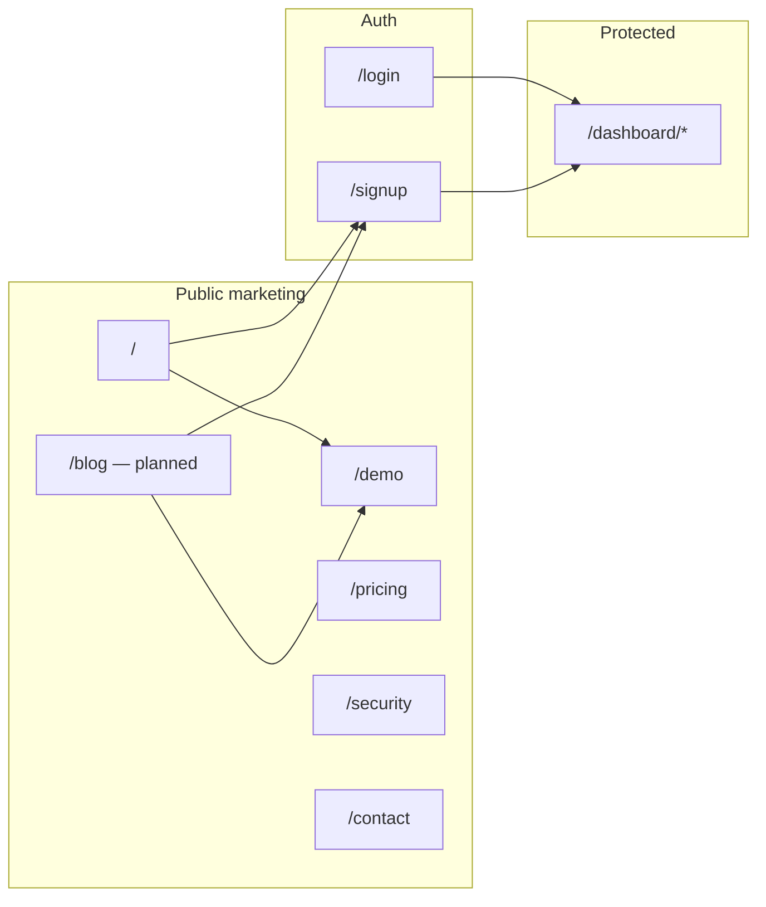

# ROAL Blog Content Plan

**Status:** Planning only (no implementation yet)  
**Journal brand:** The ROAL Journal  
**Reference:** Elyra Table Talk structure — category filters, editorial cards, article sections, stats, FAQ, related posts, product CTA — adapted to ROAL’s warm poster style (`app/landing.css`, yellow/black editorial tokens).

---

## 1. Public route audit (current)

### Marketing & content (unauthenticated, indexable)

| Route | Layout / shell | Metadata | Notes |
|-------|------------------|----------|-------|
| `/` | `LandingPage` (poster homepage) | Yes | Hero CTAs → `/demo`, `/#how`; not `MarketingShell` |
| `/demo` | `MarketingShell` | Yes | Simulated call / product preview |
| `/pricing` | `MarketingShell` | Yes | Success-based pricing story |
| `/security` | `MarketingShell` | Yes | Trust & data handling |
| `/contact` | `MarketingShell` | Yes | Pilot / sales contact |
| `not-found` | `MarketingShell` | — | 404 with Home + Login |

### Auth (public URLs, session-aware middleware)

| Route | Layout | Middleware | Notes |
|-------|--------|------------|-------|
| `/login` | `(auth)/layout` | Redirect if logged in | `next` param supported |
| `/signup` | `(auth)/layout` | Redirect if logged in | Primary nav CTA today |
| `/auth/callback` | Route handler | Matcher | OAuth / magic link |
| `/auth/signout` | Route handler | — | Sign out |

### Protected (not blog audience)

| Route | Access |
|-------|--------|
| `/dashboard/**` | Login required |
| `/api/restaurants/**`, `/api/scanner/**` | Auth required |
| Other `/api/**` | Mixed (health public; agent tools separate) |

### Gaps relevant to blog launch

- **No `/blog` or `/blog/[slug]`** today.
- **No `sitemap.xml` / `robots.txt`** in repo (add when blog ships).
- **Nav is minimal:** `LANDING_NAV` = `How it works` + Sign up; footer = Demo + Login only. Pricing, Security, Contact exist but are not in primary nav (by design — keep one new **Blog** link, avoid link farm).
- **Blog will be public** — no middleware change needed (same as `/pricing`).

---

## 2. Blog goals

| Goal | How the journal supports it |
|------|-----------------------------|
| **Organic discovery** | Rank for restaurant missed calls, AI phone ordering, live menu agents, KDS tickets, success-based pricing. |
| **AEO / answer engines** | Each full post: “Answer in short” box + FAQ block so ChatGPT/Perplexity/Google AI Overviews can cite concise answers. |
| **Trust before signup** | Owner-friendly language, illustrative math (no unsupported hard claims), tie concepts to real ROAL behavior (live menu, KDS, handoff). |
| **Conversion** | Every article ends with one CTA path: **Hear a demo call** (`/demo`) or **Sign up** (`/signup`); pilot-heavy posts may mention `/contact`. |
| **Brand consistency** | “The ROAL Journal” — warm editorial, ticket/phone motifs, same typography as landing (Fraunces + DM Sans, `landing.css`). |
| **Low maintenance** | Static posts in `lib/blog/posts.ts` (no CMS, no Supabase) until volume justifies otherwise. |

**Non-goals for v1:** Comments, author profiles, RSS (optional later), paywalled content, dashboard links in article body.

---

## 3. Categories

Restaurant-owner labels (max 5 filters on index):

| Slug | Label | Purpose |
|------|-------|---------|
| `missed-calls` | Missed calls | Rush-hour overload, voicemail failure, revenue leakage |
| `phone-orders` | Phone orders | AI ordering flow, pickup vs apps, cart → kitchen |
| `operations` | Operations | Staffing, setup, KDS workflow, handoff |
| `pricing` | Pricing | Success-based model, ROI framing |
| `ai-basics` | AI basics | Voice quality, disclosure, menu truth, trust |

---

## 4. Article roster (10 titles)

| # | Slug (proposed) | Title | Category | Content depth |
|---|-----------------|-------|----------|---------------|
| 1 | `why-restaurants-miss-calls-dinner-rush` | Why restaurants miss calls during the dinner rush | Missed calls | **Full post (priority)** |
| 2 | `ai-phone-ordering-small-restaurants` | How AI phone ordering helps small restaurants take more pickup orders | Phone orders | **Full post (priority)** |
| 3 | `cost-unanswered-restaurant-phone-calls` | The real cost of unanswered restaurant phone calls | Missed calls · Pricing | **Full post (priority)** |
| 4 | `restaurant-ai-voice-agent-sounds-human` | What makes a restaurant AI voice agent sound human? | AI basics | **Full post (priority)** |
| 5 | `phone-agent-must-know-live-menu` | Why your phone agent must know your live menu | AI basics · Phone orders | **Full post (priority)** |
| 6 | `pay-only-successful-orders` | Paying only for successful orders: why it matters | Pricing | **Full post (priority)** |
| 7 | `setup-roal-20-minutes` | How to go live with AI phone orders in about 20 minutes | Operations | Summary + strong excerpt (card-first) |
| 8 | `rush-hour-staffing-phone-line` | Rush-hour staffing: when the phone line needs its own coverage | Operations | Summary + strong excerpt |
| 9 | `phone-orders-vs-delivery-apps` | Phone orders vs delivery apps: margin, control, and guest loyalty | Phone orders | Summary + strong excerpt |
| 10 | `when-ai-should-hand-off-to-staff` | When your AI should hand off to staff (and how to make it smooth) | AI basics · Operations | Summary + strong excerpt |

**Featured on index (launch):** Post #1 (hero card) + rotate #3 or #6 as secondary featured if two slots.

---

## 5. Six priority full posts (outlines)

### Post 1 — Why restaurants miss calls during the dinner rush

- **Thesis:** Peak service splits attention; unanswered rings = lost pickup revenue.
- **Sections:** The rush-hour trap · What callers do when no one answers · Voicemail vs text-back gaps · Staff juggling expo + phone · What “always answer” looks like with ROAL (answer → menu → ticket).
- **Stats (illustrative):** “If 8 calls/hour go unanswered and 3 would have ordered…” — label as example, not industry study.
- **CTA:** Hear a demo call.
- **Internal links:** Post 3 (cost), Post 2 (how AI helps).

### Post 2 — How AI phone ordering helps small restaurants take more pickup orders

- **Thesis:** Natural phone conversation + structured cart beats forcing guests online.
- **Sections:** What guests expect on the phone · Flow: greet → items → modifiers → confirm name/phone → kitchen ticket · Why independents win on pickup · What ROAL does not replace (in-person hospitality).
- **CTA:** Sign up / demo.
- **Internal links:** Post 5 (live menu), Post 6 (pricing).

### Post 3 — The real cost of unanswered restaurant phone calls

- **Thesis:** Missed rings compound; success-based pricing aligns recovery with cost.
- **Sections:** Hidden loss (not just one order) · Simple worksheet: calls × answer rate × conversion × avg ticket · Caveat: your numbers vary · Compare per-minute phone bills vs pay-on-success · Pilot conversation.
- **CTA:** Request pilot (`/contact`) or demo.
- **Compliance:** No fabricated “$X billion industry” stats; use ranges and “example scenario.”

### Post 4 — What makes a restaurant AI voice agent sound human?

- **Thesis:** Human-like = clarity + pacing + recovery, not tricking the guest.
- **Sections:** Natural pauses and confirmations · Handling interruptions · Clarifying modifiers · Menu context in replies · Disclosure that it’s automated · Warm handoff to staff.
- **CTA:** Hear a demo call.
- **Internal links:** Post 10 (handoff), Post 5 (menu).

### Post 5 — Why your phone agent must know your live menu

- **Thesis:** Stale or hallucinated menus create wrong tickets and trust loss.
- **Sections:** 86’d items · Modifier groups · Price changes · Allergy / special requests → handoff · ROAL: scan/import → live menu → agent tools · KDS as source of truth.
- **CTA:** Sign up with menu scan story.
- **Internal links:** Post 2, dashboard marketing preview (no `/dashboard` link in copy).

### Post 6 — Paying only for successful orders: why it matters

- **Thesis:** Billing should track completed pickups on the pass, not ring volume.
- **Sections:** Define successful order (confirmed guest + finalized ticket) · ROI framing for owners · Aligned incentives vs per-minute · Pilot terms · Production pricing caveat (mirror `/pricing` FAQ).
- **CTA:** See pricing + contact for pilot.
- **Internal links:** `/pricing`, Post 3.

### Posts 7–10 (v1 card content)

- **Enough for index cards:** Title, excerpt (2–3 sentences), read time, date, category, SEO title/description, 1 AEO question each.
- **Article page:** Either “Coming soon” stub **or** short 2-section preview + CTA — **prefer full summary sections** (3–4 short blocks) so links are not thin; upgrade to full posts in phase 2.

---

## 6. SEO keyword map

**Primary cluster (head terms):**

- restaurant missed calls
- AI phone ordering for restaurants
- restaurant AI voice agent
- AI takes phone orders restaurant
- live menu phone orders

**Secondary (long-tail):**

- dinner rush unanswered phone restaurant
- cost of missed restaurant phone calls
- restaurant pickup orders AI
- kitchen display phone orders
- success based pricing restaurant AI
- restaurant voice agent live menu
- AI handoff restaurant staff

**Per-post focus keywords**

| Post | Primary keyword | Secondary |
|------|-----------------|-----------|
| 1 | restaurant missed calls dinner rush | phone line busy restaurant |
| 2 | AI phone ordering small restaurant | AI pickup orders restaurant |
| 3 | cost unanswered restaurant calls | missed call revenue restaurant |
| 4 | restaurant AI voice agent human | natural voice AI restaurant |
| 5 | live menu AI phone agent | 86 items voice ordering |
| 6 | pay per successful order restaurant | success based AI pricing |
| 7 | setup AI phone orders restaurant | go live voice agent restaurant |
| 8 | rush hour restaurant staffing phone | phone coverage dinner rush |
| 9 | phone orders vs delivery apps restaurant | pickup margin restaurant |
| 10 | AI handoff restaurant staff | escalate phone order to human |

**Technical SEO (implementation phase):**

- Unique `<title>` / `description` per route from post data.
- Canonical: `https://<production-domain>/blog/<slug>`.
- Open Graph: title, description, type `article`, optional OG image (generated or static ROAL journal asset).
- Add `/blog` + all slugs to `sitemap.xml` when created.
- `robots.txt`: allow `/blog`.

---

## 7. AEO (Answer Engine Optimization)

### Global patterns (every full post)

1. **Answer in short** — 2–4 sentence direct answer at top (featured-snippet style).
2. **FAQ block** — 3–5 Q&As; mirror in JSON-LD `FAQPage`.
3. **Definition sentences** — Plain-language “X is …” for key terms (successful order, live menu, handoff).
4. **Structured headings** — H2 questions where natural (“Why do restaurants miss calls?”).

### Sample AEO questions by post

| Post | Questions to answer in FAQ |
|------|----------------------------|
| 1 | Why do restaurants miss calls during rush? · Is voicemail enough? · How can AI answer without adding staff? |
| 2 | How does AI take a phone order? · Can AI handle modifiers? · Does it work for small restaurants? |
| 3 | How much do missed calls cost a restaurant? · How do you estimate lost orders? · What is success-based pricing? |
| 4 | How do you make AI sound human on the phone? · Should guests know it’s AI? · What if the caller interrupts? |
| 5 | Why does AI need a live menu? · What happens when an item is sold out? · Can AI guess menu items? |
| 6 | What is a successful order for billing? · Is pay-per-order better than per-minute? · What counts as not a billable order? |
| 7 | How long does ROAL setup take? · What do I need before go-live? |
| 8 | Should the host answer phones during rush? · Can AI reduce phone stress? |
| 9 | Are phone orders better than DoorDash? · Who keeps margin on pickup? |
| 10 | When should AI transfer to a person? · How do staff pick up mid-order? |

### Index page AEO

- **H1:** The ROAL Journal  
- **Short answer block:** “ROAL publishes practical guides on missed restaurant calls, AI phone ordering, live menus, and success-based pricing for independent operators.”

---

## 8. Routes (to add)

| Route | Type | Purpose |
|-------|------|---------|
| `/blog` | Static server page | Index: hero, featured card, grid, category filter |
| `/blog/[slug]` | Static dynamic segment | Article template; `generateStaticParams` from posts |

**Optional later**

| Route | Purpose |
|-------|---------|
| `/blog/category/[slug]` | Only if filter UX needs shareable URLs (v1: query `?category=` or client-only) |
| `/blog/rss.xml` | RSS feed |

**Nav / footer updates (minimal)**

- `LANDING_NAV.links`: add `{ href: "/blog", label: "Blog" }` (single new link).
- `LANDING_FOOTER.links`: add Blog (optional duplicate OK for discoverability).

---

## 9. Components (to add)

Under `components/blog/`:

| Component | Responsibility |
|-----------|----------------|
| `BlogShell` | Wraps `MarketingShell` or extends it with journal-specific background (paper texture, ticket stamps) |
| `BlogIndexHero` | “The ROAL Journal” + subcopy |
| `BlogCategoryFilter` | Chips; client filter or static active state |
| `BlogFeaturedCard` | Large hero post card |
| `BlogPostCard` | Grid card: category, title, excerpt, read time, date |
| `BlogPostGrid` | Layout for cards + empty filter state |
| `BlogArticleLayout` | Article page scaffold |
| `BlogArticleHeader` | Category, title, summary, author/date/read time |
| `BlogTableOfContents` | Anchor links to H2 sections |
| `BlogArticleSection` | Section body renderer (markdown-like blocks from data) |
| `BlogAnswerShort` | AEO highlight box |
| `BlogArticleFaq` | FAQ accordion or static list |
| `BlogRelatedPosts` | 2–3 cards same/different category |
| `BlogArticleCta` | Single CTA: demo or signup |
| `BlogJsonLd` | `BlogPosting` + `FAQPage` script tags |

**Reuse from landing**

- `MarketingShell`, `LandingNav`, `MarketingFooter`, `RoalMark`, `landing.css` tokens (`btn-primary`, `landing-wrap`, etc.).

---

## 10. Library & data files (to add)

Under `lib/blog/`:

| File | Purpose |
|------|---------|
| `types.ts` | `BlogPost`, `BlogCategory`, `BlogSection`, `BlogFaq`, `BlogSeo`, `BlogCta` |
| `categories.ts` | Category slug → label |
| `posts.ts` | All 10 posts: metadata, sections (6 full), FAQ, AEO, related slugs |
| `index.ts` | `getAllPosts`, `getPostBySlug`, `getPostsByCategory`, `getRelatedPosts` |

**Optional helpers**

| File | Purpose |
|------|---------|
| `lib/blog/reading-time.ts` | Words → “N min read” |
| `lib/blog/json-ld.ts` | Build BlogPosting / FAQ JSON-LD objects |

---

## 11. App routes & files (to add)

```
app/blog/
  page.tsx              # index + metadata
  [slug]/
    page.tsx            # article + generateMetadata + generateStaticParams
```

**SEO / discovery (phase after pages)**

```
app/sitemap.ts          # include /blog + slugs
app/robots.ts           # allow crawl
public/og/blog-default.png   # optional fallback OG (or SVG in public/)
```

---

## 12. Content governance

| Rule | Detail |
|------|--------|
| Voice | Second person sparingly; mostly “you” / “your restaurant”; no jargon (KDS ok once defined). |
| Claims | Illustrative math only with “example scenario” label. |
| Product | Mention ROAL features that exist today: voice agent, live menu, menu scan, KDS tickets, notifications/handoff, success pricing. |
| Legal | No competitor defamation; compare categories (delivery apps) not brands. |
| Updates | `publishedAt` / `updatedAt` in post records; refresh pricing post when `/pricing` copy changes. |

**Author line (static v1):** “ROAL Team” · no individual bios.

---

## 13. Implementation sequence (for follow-up prompts)

Aligns with `docs/blog-and-theme-cursor-prompts.md`:

1. `lib/blog/posts.ts` + types (6 full bodies, 4 summaries)  
2. `/blog` index UI + metadata  
3. `/blog/[slug]` template + JSON-LD + AEO blocks  
4. Nav/footer Blog link  
5. `sitemap` / `robots`  
6. Visual polish (ticket motifs) + QA lint/build + mobile check  

**Out of scope:** Supabase, dashboard, API, billing logic.

---

## 14. Success metrics (post-launch)

- Indexing: Search Console URLs for `/blog` and 6 full articles within 2–4 weeks.
- Engagement: CTR from blog CTA → `/demo` and `/signup` (analytics event if/when added).
- Quality: Lighthouse SEO ≥ 90 on article template; no horizontal overflow on 375px width.

---

## Appendix: Current public route diagram



---

*Document owner: growth/content + frontend. Next artifact: `lib/blog/posts.ts` (prompt #2 in blog queue).*
