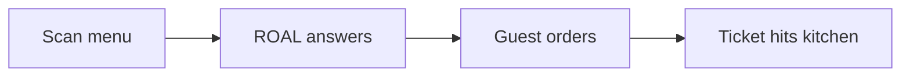

# Homepage scroll story plan (Prompt 13)

**Date:** 2026-05-23  
**Status:** Plan only — **no implementation**  
**Implements:** Prompts **13** (plan) → **14–16** (build + motion + QA) in [`premium-ui-rebuild-40-prompts.md`](./premium-ui-rebuild-40-prompts.md)  
**Anchor:** `#how` (keep for nav `/#how`)

**Related:** [`HOME_HOW_FLOW_PLAN.md`](./HOME_HOW_FLOW_PLAN.md) (earlier 4-beat spec with “connect line”) · [`PREMIUM_UI_REBUILD_PLAN.md`](./PREMIUM_UI_REBUILD_PLAN.md) (theme contract)

---

## Goal

One homepage section that tells a **short cinematic story** in four beats—skimmable in one pass, premium glass aesthetic, no poster scroll-chapter bloat:

| # | Beat | Owner takeaway |
|---|------|----------------|
| 1 | **Scan menu** | My menu is in the system fast. |
| 2 | **ROAL answers** | The phone is picked up with my menu—not a generic bot. |
| 3 | **Guest orders** | The caller places a real pickup order on the line. |
| 4 | **Ticket hits kitchen** | The same order lands on the KDS like staff typed it. |

**Tone:** Calm, confident, layman. No Supabase/ElevenLabs/RLS on the section face.  
**Length budget:** ~1–1.5 mobile screens total (not four full-viewport pins).

---

## Gap vs current build

Today `HomeHowFlow` is **already built** (sticky stage + Intersection Observer) but the narrative is:

`scan-menu` → **`connect-line`** → `ai-answers` → `ticket-lands`

| Prompt 13 beat | Current `HowFlowBeatId` | Action at implement time |
|----------------|-------------------------|---------------------------|
| Scan menu | `scan-menu` | **Keep** — tighten copy/visual |
| ROAL answers | `connect-line` + `ai-answers` | **Merge** into one beat `roal-answers` (line routing implied in one line of copy or subtle diagram) |
| Guest orders | *(partially inside `ai-answers` transcript)* | **New beat** `guest-orders` — order-building moment (transcript + cart lines) |
| Ticket hits kitchen | `ticket-lands` | **Keep** — rename title to “Ticket hits your kitchen” if needed |

**Remove** standalone “Connect your line” as its own scroll step—it breaks the cinematic arc and feels like setup, not story.

---

## Recommended layout (keep pattern, refine story)

Reuse the proven **sticky stage + scrolling steps** pattern from the existing implementation—do not redesign into a generic 3-card grid or full-page scrollytelling.

```text
┌──────────────────────────────────────────────────────────┐
│  Eyebrow: How it works                                   │
│  H2: Your menu → a call → a kitchen ticket              │
│  Lead: one line (optional)                               │
│  ● ○ ○ ○  progress dots                                  │
├─────────────────────┬────────────────────────────────────┤
│  STICKY GLASS STAGE │  SCROLL STEPS (ordered list)       │
│  (one scene)        │  1 Scan menu          ← active     │
│  cross-fade between │  2 ROAL answers                    │
│  four visuals       │  3 Guest orders                    │
│                     │  4 Ticket hits kitchen             │
└─────────────────────┴────────────────────────────────────┘
```

### Desktop (≥900px)

| Element | Spec |
|---------|------|
| **Stage** | `position: sticky`; single glass panel; one visual at a time; `opacity` cross-fade 240–320ms |
| **Steps** | Right column; Intersection Observer sets `activeBeat` (`rootMargin: -40%` — already in code) |
| **Section height** | `max(72vh, 4 × ~5.5rem)` — enough scroll room per beat, not 4×100vh |
| **Progress** | Four dots under header (already present); optional thin progress line inside stage |

### Mobile (<900px)

| Element | Spec |
|---------|------|
| **Sticky** | **Off** — stacked step → inline visual → next step (already mobile pattern) |
| **Visual** | Repeat compact visual under each step copy (already `HowFlowBeatVisual` per step) |
| **Overflow** | `min-width: 0`, `overflow-wrap: anywhere` on transcript/ticket (QA in prompt 16) |

### `prefers-reduced-motion: reduce`

| Behavior | Spec |
|----------|------|
| Observer / cross-fade | **Disabled** (already gated by `usePrefersMotion`) |
| Layout | All four steps + four small static thumbnails visible (2×2 grid or vertical list—extend current reduced-motion CSS if needed) |
| No auto-scroll | User scrolls normally |

---

## Beat spec (copy direction for prompts 14–15)

Proposed `HowFlowBeatId`: `"scan-menu" | "roal-answers" | "guest-orders" | "ticket-lands"`

| `id` | Step | Title | Body (≤20 words) | Stage visual |
|------|------|-------|------------------|--------------|
| `scan-menu` | 1 | Scan your menu | Snap a photo of your printed menu—we turn it into items you can edit. | Menu scan card (`build-menu-scan-preview` / `how-flow-scan-visual`) |
| `roal-answers` | 2 | ROAL answers | Your line rings; ROAL picks up with your live menu and sounds like your team. | Phone + “live” badge + short waveform or 1-line ROAL greeting (`how-flow-call-visual` + slim line SVG, no carrier logos) |
| `guest-orders` | 3 | Guest orders | Guest adds items and confirms pickup—modifiers and prices from your menu. | 3–4 line transcript + mini line items (`agent-conversation-demo` trimmed, or static) |
| `ticket-lands` | 4 | Ticket hits your kitchen | Name, phone, and items appear on your KDS—same ticket your staff would see. | Kitchen ticket (`build-kitchen-ticket-preview` / `how-flow-ticket-visual`) |

**Section header (proposed refresh)**

| Field | Copy |
|-------|------|
| Eyebrow | `How it works` |
| H2 | `From menu scan to kitchen ticket` or `Your menu, a phone call, your kitchen screen` |
| Lead | `Four beats you’ll see in the first pilot week—not a long setup guide.` |
| `visualLabel` | `Illustrative preview` (keep) |

All visuals that use demo data must keep **`Illustrative preview`** (or `ILLUSTRATIVE_DEMO_LABEL` from `metrics-safety.ts`).

---

## Cinematic but simple — motion vocabulary

| Do | Don’t |
|----|--------|
| Stage **opacity** cross-fade on beat change | Height animations that reflow layout |
| Active step: slight `translateY(8px)` → `0`, stronger ink | Scroll-jacking / pinned full viewport per beat |
| Beat 4: one-time ticket **settle** (`translateY` 6px → 0, 400ms) | Looping pulse on phone/orb |
| Progress dot fill / scale | Autoplay audio |
| Optional: faint **call pulse** ring on `roal-answers` only (CSS `scale`, 2 cycles) | GSAP chapter rail, yellow poster shadows |

**Transforms only** (`opacity`, `transform`) — matches [`MOTION_CONSISTENCY.md`](./MOTION_CONSISTENCY.md) and theme contract.

---

## Narrative flow (why this order)



1. **Scan menu** — establishes “we know your menu.”  
2. **ROAL answers** — payoff for “missed call” hero promise.  
3. **Guest orders** — proof it’s a real order, not phone tree theater.  
4. **Ticket hits kitchen** — operational close: expo sees the same ticket.

No beat should require reading dashboard docs.

---

## Files to touch (implementation — prompts 14–16)

| File | Change |
|------|--------|
| `lib/landing/home-how-flow-copy.ts` | Replace beats array; update types (`HowFlowBeatId`); new header copy |
| `lib/landing/home-how-flow-data.ts` | Wire visuals for `guest-orders`; drop `connect-line` |
| `components/landing/home/how-flow/home-how-flow.tsx` | Update `BEAT_IDS` source; observer unchanged |
| `components/landing/home/how-flow/how-flow-stage.tsx` | Map four beat ids → panes |
| `components/landing/home/how-flow/how-flow-beat-visual.tsx` | Switch for `guest-orders` |
| `components/landing/home/how-flow/how-flow-line-visual.tsx` | **Fold into** `roal-answers` or delete if unused |
| `components/landing/home/how-flow/how-flow-call-visual.tsx` | Primary for `roal-answers` |
| `components/landing/home/how-flow/how-flow-scan-visual.tsx` | Beat 1 |
| `components/landing/home/how-flow/how-flow-ticket-visual.tsx` | Beat 4 + settle motion hooks |
| **New** `how-flow-order-visual.tsx` (optional) | Beat 3 transcript + cart |
| `components/landing/home/sections/home-how-it-works.tsx` | No change if still wraps `HomeHowFlow` |
| `app/landing-home.css` | Adjust `.home-how-flow*` heights; `guest-orders` / `roal-answers` styles; reduced-motion grid |

**Do not change:** `LandingHomeShell`, hero video, auth, ElevenLabs routes, dashboard KDS.

---

## Accessibility (carry into build)

- `section#how` + `aria-labelledby="how-heading"`.  
- Steps: `<ol>` with `aria-current="step"` on active (already).  
- Stage: `aria-live="polite"` on beat change — announce “Step 2: ROAL answers”.  
- Decorative stage duplicate on mobile: `aria-hidden` on redundant visual if copy repeats.  
- No focus trap; optional “Hear a demo call” link to `/demo` below section (footer of `#how`).

---

## What we are not doing

- Full-bleed video inside the stage (hero owns video).  
- Center decorative orbs or poster lime/cream panels.  
- Per-step URL hashes (`#how-2`).  
- Live restaurant data / realtime KDS in scroll story.  
- Fifth beat (pricing, signup, etc.)—that’s hero + pay teaser + FAQ.

---

## Acceptance criteria (prompts 14–16)

1. Owner can paraphrase **menu → answer → order → ticket** after one scroll.  
2. **Four beats only**; no separate “connect line” step.  
3. Desktop: sticky stage updates with scroll; mobile: obvious stacked story.  
4. Reduced motion: all beats visible without choreography.  
5. Section matches glass/lavender theme; ≤ ~1.5 mobile screens vs pre-story homepage.  
6. No horizontal overflow at 375px; demo visuals labeled illustrative.

---

## Implementation order

1. **Prompt 14** — Copy + beat ids + merge visuals (`roal-answers`, `guest-orders`).  
2. **Prompt 15** — Motion polish (transitions, ticket settle, call pulse).  
3. **Prompt 16** — Mobile + reduced-motion QA.

*Next in queue: **14. Scroll Story Build** — execute this plan.*
