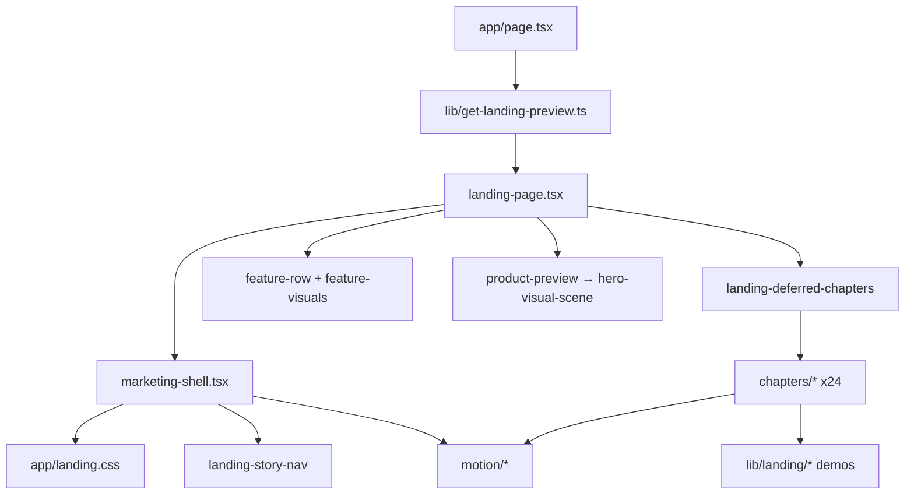

# Landing Simple Reset — Scope Audit

**Date:** 2026-05-22  
**Status:** Plan only — no implementation in this doc.  
**Queue:** Step 1 of `docs/landing-simple-reset-prompts.md`.

---

## Goal

One homepage (`/`) with **at most five sections**, brochure-style, layman copy:

| # | Section | Job |
|---|---------|-----|
| 1 | **Hero** | Promise + primary CTA + simple illustration |
| 2 | **Why it matters** | Missed calls during a busy shift cost orders |
| 3 | **How it works** | Upload menu → connect phone → take orders |
| 4 | **Pay on orders** | Only pay when an order succeeds |
| 5 | **Final CTA** | Sign up / try demo — one closing band |

**North-star message:** Never miss a restaurant call; ROAL answers like a human and turns calls into kitchen tickets.

**Out of scope for this reset:** Dashboard, auth, Supabase, APIs, migrations, KDS product code. Satellite routes (`/demo`, `/pricing`, `/security`, `/contact`) stay on disk but are **not promoted** from the new homepage nav/footer.

---

## Current state (homepage)

**Entry:** `app/page.tsx` → `getLandingPreview()` → `LandingPage` → `MarketingShell`.

**Today:** `components/landing/landing-page.tsx` renders **17 logical blocks** (hero + 15 story/product chapters + pricing teaser + dark CTA). Nav is a **chapter rail** (`LandingStoryNav` + `LANDING_HOME_CHAPTERS` with 18 anchors). Shell loads scroll progress + chapter choreography + ~1.5k lines of chapter/motion CSS in `app/landing.css`.

### Homepage section map (remove → target)

| Current `id` / block | Component(s) | Target section |
|----------------------|--------------|----------------|
| `#hero` | Inline + `ProductPreview` → `HeroVisualScene` | **Hero** (replace visual/copy) |
| `#rush` | `RushHourChapter` (sync) | Fold into **Why it matters** |
| `#lost-revenue` | `DeferredLostRevenueChapter` | Fold into **Why it matters** |
| `#conversation` | `DeferredHumanAgentChapter` | **Stop** (too deep for 5-section page) |
| `#live-menu` | `DeferredLiveMenuTruthChapter` | Fold one line into **How it works** |
| `#kitchen-ticket` | `DeferredKitchenTicketChapter` | Fold one line into **How it works** |
| `#success-pricing` | `DeferredSuccessPricingChapter` | **Pay on orders** |
| `#setup` | `DeferredSetupChapter` | Merge into **How it works** (3 steps) |
| `#differentiators` | `DeferredDifferentiatorBentoChapter` | **Stop** |
| `#contrast` | `DeferredCompetitorContrastChapter` | **Stop** |
| `#human-handoff` | `DeferredHumanHandoffChapter` | **Stop** |
| `#menu-scan` … `#handoff` | Four `FeatureRow`s + `feature-visuals` | **Stop** (dense product stack) |
| `#trust` | `DeferredTrustSafetyChapter` | **Stop** on `/` (keep `/security`) |
| `#proof` | `DeferredSocialProofChapter` | **Stop** |
| `#hear-demo` | `DeferredAudioDemoChapter` | Optional one-liner in hero/CTA only; no full chapter |
| `#pricing` | Inline links to `/pricing` | **Stop** on `/` |
| (final band) | Dark `LandingCta` | **Final CTA** |

---

## Target homepage structure (wireframe)

```
[ Minimal nav: logo | How it works | Try demo | CTA ]

1. HERO
   H1 + 1–2 sentences + Try demo / See how it works
   Custom line-art illustration (phone → ticket), subtle motion
   Trust strip: Answers calls | Takes orders | Sends tickets

2. WHY IT MATTERS  (#why)
   “Busy shift” — 3 beats: rings / staff busy / order missed
   Visual storyboard, ≤12 words per beat

3. HOW IT WORKS  (#how)
   3 steps: menu photo → phone connected → orders on kitchen screen
   Chunky numbered cards; no Supabase/ElevenLabs/RLS copy

4. PAY ON ORDERS  (#pricing-story)
   “Only pay when an order is successful” + 2 sentences max
   Simple invoice/ticket visual (answered vs charged)

5. FINAL CTA
   One headline + `LandingCta` + link to `/demo` only if needed
```

**Anchor IDs (replace `LANDING_HOME_CHAPTERS`):** `hero`, `why`, `how`, `pricing-story`, `cta` (final band may use `#cta` without nav item).

---

## Files to **replace** (rewrite in place)

These stay as the integration surface; content/imports change, not paths.

| File | Action |
|------|--------|
| `app/page.tsx` | Keep route; update metadata to simple promise; **consider** dropping `getLandingPreview()` if hero no longer needs live DB preview |
| `components/landing/landing-page.tsx` | **Full replace** — only 5 sections; no deferred chapters, no `FeatureRow` stack |
| `components/landing/marketing-shell.tsx` | **Replace** — wrapper + skip link + simple nav + main + compact footer; remove `LandingScrollProgress`, `LandingScrollChoreography` |
| `components/landing/landing-nav.tsx` | **Replace** — stop re-exporting story nav; minimal links |
| `components/landing/landing-story-nav.tsx` | **Replace or delete** after nav rewrite (chapter rail removed) |
| `components/landing/marketing-footer.tsx` | **Replace** — single row; Demo + Login only |
| `app/landing.css` | **Replace / trim** — brochure tokens; remove chapter/rush/hero-scene/KDS-scroll bulk (~70% of file) |
| `lib/landing/chapters.ts` | **Replace** — `LANDING_HOME_CHAPTERS` → 3 nav anchors; trim `LANDING_PAGE_LINKS` / `LANDING_CTA` for simple CTAs |

**New components (expected, not created yet):**

| File | Purpose |
|------|---------|
| `components/landing/sections/landing-hero.tsx` | Hero + illustration + trust strip |
| `components/landing/sections/landing-why.tsx` | Busy-shift storyboard |
| `components/landing/sections/landing-how.tsx` | 3-step process |
| `components/landing/sections/landing-pay.tsx` | Success pricing visual |
| `components/landing/sections/landing-final-cta.tsx` | Closing band (or inline in `landing-page.tsx` if small) |
| `components/landing/illustrations/` (optional) | Shared SVG/CSS line-art primitives |

---

## Files to **stop using on `/`** (do not import from new `landing-page.tsx`)

Leave on disk until step 35 of the prompt queue; then delete if zero imports.

### Orchestration / motion (homepage-only)

| File | Reason |
|------|--------|
| `components/landing/landing-deferred-chapters.tsx` | All dynamic chapter loaders |
| `components/landing/landing-chapter-fallback.tsx` | Deferred loading placeholders |
| `components/landing/motion/landing-scroll-choreography.tsx` | Chapter rail wrapper |
| `components/landing/motion/landing-scroll-progress.tsx` | Top progress bar |
| `components/landing/motion/landing-chapter-rail.tsx` | 18-chapter nav |
| `components/landing/motion/use-landing-active-chapter.ts` | Chapter spy |
| `components/landing/motion/landing-sticky-chapter.tsx` | Pinned chapters |
| `components/landing/motion/landing-marquee.tsx` | Marquee motion |
| `components/landing/motion/landing-counter.tsx` | Animated counters |
| `components/landing/motion/landing-reveal.tsx` | Chapter reveals (unless reused lightly in hero) |
| `components/landing/motion/use-landing-motion.ts` | Heavy motion hook |
| `components/landing/motion/index.ts` | Re-exports above |

### Story chapters (`components/landing/chapters/**`) — all 24 files

| File |
|------|
| `audio-demo-chapter.tsx` |
| `competitor-contrast-chapter.tsx` |
| `competitor-contrast-visual.tsx` |
| `conversation-transcript.tsx` |
| `differentiator-bento-chapter.tsx` |
| `differentiator-bento-mini-visuals.tsx` |
| `human-agent-chapter.tsx` |
| `human-handoff-chapter.tsx` |
| `human-handoff-routing-visual.tsx` |
| `kds-motion-scene.tsx` |
| `kitchen-ticket-chapter.tsx` |
| `live-menu-truth-chapter.tsx` |
| `lost-revenue-chapter.tsx` |
| `rush-hour-chapter.tsx` |
| `rush-horizontal-timeline.tsx` |
| `setup-chapter.tsx` |
| `setup-step-visuals.tsx` |
| `setup-timeline-motion.tsx` |
| `social-proof-chapter.tsx` |
| `success-pricing-chapter.tsx` |
| `success-pricing-visual.tsx` |
| `ticket-stack-backdrop.tsx` |
| `trust-safety-chapter.tsx` |
| `trust-safety-mini-visuals.tsx` |

### Homepage product stack / cinematic hero

| File | Reason |
|------|--------|
| `components/landing/feature-row.tsx` | Four-up enterprise feature stack |
| `components/landing/feature-visuals.tsx` | Only used by homepage stack + partial demo |
| `components/landing/product-preview.tsx` | Hero DB/cinematic preview |
| `components/landing/hero/hero-visual-scene.tsx` | Heavy framer hero scene |
| `components/landing/hero/hero-scroll-cue.tsx` | Scroll-to-chapter cue |
| `components/landing/hero/hero-motion.ts` | Hero motion helpers |
| `components/landing/preview/kds-hero-preview.tsx` | Dashboard-style hero mock |
| `components/landing/preview/kds-feature-preview.tsx` | KDS scroll animation |
| `components/landing/preview/menu-scanner-preview.tsx` | Menu scan UI |
| `components/landing/preview/voice-agent-preview.tsx` | Agent tool UI chrome |
| `components/landing/preview/handoff-visual.tsx` | Handoff feature panel |
| `components/landing/preview/phone-orders-preview.tsx` | Phone orders mock |
| `components/landing/preview/menu-sidebar-preview.tsx` | Sidebar mock |
| `components/landing/preview/shared.tsx` | Preview frames (delete only if nothing left imports) |
| `components/landing/landing-section.tsx` | Optional — keep if wrappers still useful; else inline simple `<section>` |
| `components/landing/marketing-page-hero.tsx` | Not used on `/` (satellite only) |

### `lib/landing/*` demo data — stop using on `/`

| File | Used by |
|------|---------|
| `lib/landing/agent-conversation-demo.ts` | human-agent, conversation-transcript |
| `lib/landing/audio-demo-demo.ts` | audio-demo-chapter |
| `lib/landing/bucket-scroll-progress.ts` | kds-motion-scene, ticket-stack |
| `lib/landing/build-kitchen-ticket-preview.ts` | kitchen-ticket-chapter |
| `lib/landing/build-menu-scan-preview.ts` | menu-scanner-preview |
| `lib/landing/competitor-contrast-demo.ts` | competitor chapters |
| `lib/landing/differentiator-bento-demo.ts` | bento chapter |
| `lib/landing/human-handoff-demo.ts` | handoff chapters |
| `lib/landing/kds-motion-demo.ts` | kds-motion-scene |
| `lib/landing/live-menu-truth-demo.ts` | live-menu chapter |
| `lib/landing/lost-revenue-calculator.ts` | lost-revenue chapter |
| `lib/landing/motion-config.ts` | motion + chapters (trim if hero keeps light motion) |
| `lib/landing/setup-story-demo.ts` | setup chapter |
| `lib/landing/social-proof-demo.ts` | social-proof chapter |
| `lib/landing/trust-safety-demo.ts` | trust chapter |
| `lib/landing/success-pricing-demo.ts` | **Maybe keep** — reuse copy shape in `landing-pay` |
| `lib/landing/footer-copy.ts` | **Replace** — column link arrays unused |

**`lib/get-landing-preview.ts` + `lib/landing-demo-data.ts`:** Stop on `/` if hero is illustration-only. **Keep** for `/demo` until demo page is simplified.

---

## Files to **keep** (unchanged or light touch)

| File | Role |
|------|------|
| `components/landing/landing-cta.tsx` | CTAs — update labels/hrefs in step 8–9 |
| `components/landing/roal-mark.tsx` | Logo — used by nav, footer, auth layout, dashboard shell |
| `components/landing/marketing-shell.tsx` | Path stays; behavior simplified |
| `components/landing/pricing/pricing-page-content.tsx` | `/pricing` |
| `components/landing/contact/contact-page-content.tsx` | `/contact` |
| `components/landing/contact/contact-pilot-form.tsx` | `/contact` |
| `components/landing/security/security-page-content.tsx` | `/security` |
| `components/landing/demo/demo-page-content.tsx` | `/demo` — light style align later |
| `components/landing/demo/demo-call-simulation.tsx` | Demo only |
| `components/landing/demo/demo-conversation-section.tsx` | Demo only |
| `lib/landing/pricing-page-copy.ts` | `/pricing` |
| `lib/landing/contact-page-copy.ts` | `/contact` |
| `lib/landing/security-page-copy.ts` | `/security` |
| `lib/landing/demo-page-copy.ts` | `/demo` |
| `app/demo/page.tsx`, `app/pricing/page.tsx`, `app/security/page.tsx`, `app/contact/page.tsx` | Satellite routes |
| `app/not-found.tsx` | Uses `MarketingShell` — inherits shell simplification |
| `app/(auth)/layout.tsx` | `RoalMark` only |
| `components/dashboard/app-shell.tsx` | `RoalMark` only |
| `tailwind.config.ts` | Landing max-width/easing tokens — OK to keep |

---

## Docs to **stop using** as build source

| Doc | Action |
|-----|--------|
| `docs/LANDING_STORY_BLUEPRINT.md` | Superseded by this reset — archive/reference only |
| `docs/landing-story-prompts.md` | Old 40-prompt story build — do not follow for homepage |
| `docs/landing-simple-reset-prompts.md` | **Active** queue (steps 2–40) |

---

## Dependency graph (what pulls weight today)



**After reset:** `page → landing-page → marketing-shell → landing.css` + 4–5 section components + minimal nav/footer. No `preview` on `/` unless demo strip needs it.

---

## Copy / UX rules (homepage only)

- Restaurant owner reading level; no RLS, webhooks, Gemini, ElevenLabs on `/`.
- Nav: logo + **How it works** (`#how`) + **Try demo** (`/demo`) + one CTA (`/signup` or primary).
- Footer: copyright + optional Demo + Login — **no** Product/Company/Platform columns.
- Motion: hero float/pulse only; `prefers-reduced-motion` respected; no scroll pinning.
- Visual: warm off-white, black ink, one accent; thick rounded panels; custom line art (no stock photos).

---

## Implementation order (from prompt queue)

1. **This doc** — scope locked  
2. Skeleton `landing-page.tsx` — 5 sections, compile, no deletes  
3. Simplify `marketing-shell.tsx` + nav + footer  
4. Trim `app/landing.css` toward brochure tokens  
5. Build section components + hero illustration  
6. Copy/metadata pass; remove unused imports from `/` bundle  
7. Light `/demo` align if broken  
8. Delete orphan files only when `grep` shows zero imports  
9. `npm run lint` + `npm run build`

---

## Success checklist

- [ ] `/` has exactly **5** scroll sections (+ minimal nav/footer)  
- [ ] No chapter rail, scroll progress, or deferred chapter imports on `/`  
- [ ] Homepage JS bundle does not load `chapters/*` or heavy `preview/*`  
- [ ] Visitor gets offer in **<10 seconds** without scrolling far  
- [ ] `/pricing`, `/security`, `/contact` not linked from homepage nav/footer (demo + login OK)  
- [ ] `docs/LANDING_SIMPLE_RESET.md` updated when implementation completes (file delete list, preview decision)

---

## File counts

| Category | Count |
|----------|------|
| Landing components (`components/landing/**`) | 94 paths (glob) |
| Stop on `/` (chapters + motion + homepage stack) | ~52 component files + 15 lib demos |
| Replace in place | 8 files |
| Keep (satellite + shared) | ~15 files |
| New (planned) | ~5–6 section/illustration files |

**Net effect:** Homepage path should import **<15** landing files vs **50+** today.
