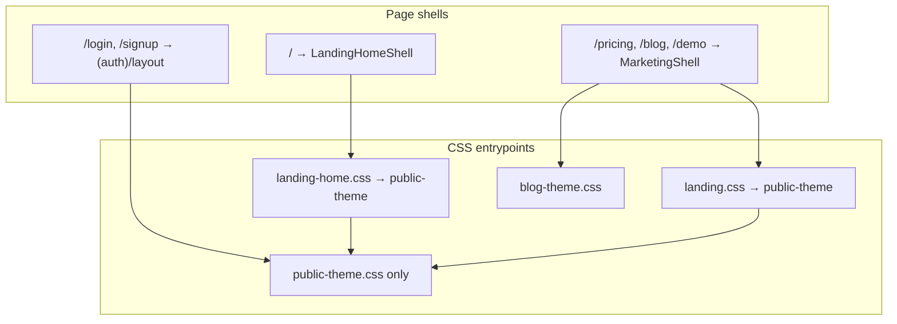

# Premium UI Rebuild Plan (Audit — Prompt 1)

**Date:** 2026-05-23  
**Scope:** `/`, `/pricing`, `/blog`, `/demo`, `/login`, `/signup`, and all public CSS.  
**Status:** Prompts **1** (audit) and **2** (theme contract) complete — **no implementation yet.**

**North star** (from [`premium-ui-rebuild-40-prompts.md`](./premium-ui-rebuild-40-prompts.md)): short, premium, high-converting public site — ethereal video + glass + lavender/pink/amber wash + black pill CTAs. One pricing story: **only pay for successful orders · $0.90/order**.

**Related audits (already written):**

- [`BLOG_THEME_AUDIT.md`](./BLOG_THEME_AUDIT.md) — poster/yellow remnants (partially addressed via `blog-theme.css`; legacy block still in `landing.css`)
- [`AUTH_LOGIN_THEME_AUDIT.md`](./AUTH_LOGIN_THEME_AUDIT.md), [`AUTH_SIGNUP_THEME_AUDIT.md`](./AUTH_SIGNUP_THEME_AUDIT.md) — auth chrome gaps
- [`BACKGROUND_CONSISTENCY.md`](./BACKGROUND_CONSISTENCY.md) — video vs wash policy

---

## Executive summary

| Area | Verdict |
|------|---------|
| **Theme direction** | Correct tokens exist (`public-theme.css`); execution is **inconsistent** across two shells and ~7.5k lines of public CSS |
| **Homepage `/`** | Too many sections; hero copy/layout not “million-dollar”; video may be weak after hydration; generic 3-card grids duplicate scroll story |
| **`/pricing`** | Reads like a **long SaaS pricing report** (AEO + card + included + compare + success model + 3 plans + FAQ + close) — contradicts single-rate message |
| **`/blog`** | **Dual CSS** (`landing.css` + `blog-theme.css`); index still heavy (hero + AEO band + full grid); motifs busy |
| **`/demo`** | Structure OK for target; section count and poster-era visuals need tightening |
| **Auth** | Isolated stack is good; signup grid + form inputs still feel “dashboard on marketing wash” |
| **CSS debt** | `landing.css` still owns poster tokens (cream/yellow/lime, `5px 5px` shadows) and ~107 `.blog-*` rules that fight `blog-theme.css` |

---

## Architecture today



| Route | Page file | Shell | CSS imported |
|-------|-----------|-------|----------------|
| `/` | `app/page.tsx` | `LandingHomeShell` | `app/landing-home.css` → `public-theme` |
| `/pricing` | `app/pricing/page.tsx` | `MarketingShell` | `app/landing.css` → `public-theme` |
| `/blog` | `app/blog/page.tsx` | `MarketingShell` | `app/landing.css` + `app/blog-theme.css` |
| `/blog/[slug]` | `app/blog/[slug]/page.tsx` | via `BlogArticleLayout` | `landing.css` (shell) + `blog-theme.css` |
| `/demo` | `app/demo/page.tsx` | `MarketingShell` | `app/landing.css` |
| `/login` | `app/(auth)/login/page.tsx` | `(auth)/layout` | `app/public-theme.css` |
| `/signup` | `app/(auth)/signup/page.tsx` | `(auth)/layout` | `app/public-theme.css` |

**Line counts (approx.):** `public-theme.css` 3063 · `landing-home.css` 1414 · `landing.css` 2229 · `blog-theme.css` 493 · mobile/desktop splits 192+126.

---

## What looks bad (by surface)

### `/` — Homepage

| Issue | Why it hurts premium feel |
|-------|---------------------------|
| **9 stacked sections** | Feels long and “marketing template,” not a tight product landing |
| **Hero** bottom-anchored layout + large `home-hero__spacer` | Unusual composition; headline/CTA fight video instead of one clear focal stack |
| **Hero copy** | Operational/qualified (“during rush,” long lead, disclaimer-sized qualifier) — not the punchy line in prompt queue |
| **`HomeSolution` 3-card grid** | Generic feature cards; **duplicates** `HomeHowItWorks` / scroll story narrative |
| **`HomeSavingsCard`** | Spreadsheet ROI table — reads like internal dashboard, not trust strip |
| **`HomeProductProof`** | Second product demo after how-flow — heavy, redundant with `/demo` |
| **`HomePay` + pricing pill + FAQ** | Three pricing touches on one page before `/pricing` |
| **Video layer** | `LandingVideoBackground` initializes `gradientOnly: true` → no video until client effect; combined with scrim/blobs, background can look **flat** (prompts 3–4) |
| **Motion** | `public-reveal` stagger on many blocks — risk of “animated template” without scroll-story focus |

### `/pricing`

| Issue | Why it hurts |
|-------|----------------|
| **Too many sections** after hero | AEO answer → primary card → included → compare → success model (visual + 2 lists + caveat) → **3-plan grid** → FAQ → ink CTA band |
| **`PRICING_PLANS` 3-column cards** | Implies multi-SKU pricing; conflicts with “only $0.90 per successful order” |
| **`PricingCompare` + `SuccessPricingVisual` + duplicate lists** | Same story told 3–4 times; page length and cognitive load |
| **`PricingIncluded` feature grid** | Enterprise “everything included” wall |
| **Section chrome** | `LandingSection` + `border-b` rhythm feels report-like, not one hero card |
| **Legacy visual** | `SuccessPricingVisual` tied to chapter/poster era |

### `/blog` (index + articles)

| Issue | Why it hurts |
|-------|----------------|
| **CSS conflict** | ~107 `.blog-*` rules in `landing.css` **and** ~88 in `blog-theme.css` — specificity/order bugs, yellow/cream leaks |
| **Index structure** | Hero + **dedicated AEO section** + category filter + featured + full grid — top-heavy for a “journal” |
| **`BlogMotifLayer`** | Comic rings/scribbles — busy under glass (see `BLOG_THEME_AUDIT.md`) |
| **Articles** | TOC + AEO answer + sections + FAQ + related + CTA — acceptable for SEO but visually dense |
| **Class mix** | Still uses `landing-wrap`, `landing-section` from poster layout system |

### `/demo`

| Issue | Why it hurts |
|-------|----------------|
| **5 content sections + CTA band** after hero | Acceptable but borderline long |
| **Hero double wrapper** | `public-demo-hero` + `MarketingPageHero` — extra wash layer vs other pages |
| **Placeholder video block** | Fine for launch if clearly premium frame; must not look broken |
| **Simulation sections** | Risk of poster panels if still using `landing-beat-*` / ticket chrome from old theme |

### `/login` & `/signup`

| Issue | Why it hurts |
|-------|----------------|
| **Inputs** | Historically flat `bg-base` utilities vs glass inset fields on `/contact` (see auth audits) |
| **Signup layout** | `SignupOnboardingAside` + form — dense on mobile; two competing stories |
| **No dedicated signup layout** | Same auth canvas as login — “onboarding entry” mostly copy, not composition |
| **Metadata** | Thin titles only vs full marketing metadata on other routes |

### Public CSS (cross-cutting)

| Issue | Why it hurts |
|-------|----------------|
| **Two parallel design systems** | `.landing-home` vs `.landing-story` + duplicated nav/footer patterns |
| **Poster tokens in `landing.css`** | `--landing-yellow`, `--landing-cream`, `--landing-lime`, `5px 5px 0` shadows still referenced |
| **`landing.css` size** | 2229 lines — hard to reason about; blog + pricing + demo + poster orphans cohabit |
| **Token alias sprawl** | `--home-*` mirrors `--public-*` — necessary but easy to drift |
| **globals bleed** | `btn-primary` / `glass-card` in `globals.css` overridden under `.public-theme` — fragile for auth/marketing |

---

## What to remove (or collapse)

### Homepage sections (target **5–6** max per prompt queue)

| Remove or merge | Into |
|-----------------|------|
| `HomeSolution` (3-card + trust list) | Scroll story + one-line trust strip |
| `HomeSavingsCard` | Optional single metric line in trust strip — not full table |
| `HomeProductProof` | `/demo` or one frame inside scroll story |
| Redundant `HomePay` body | Short pricing teaser + pill link to `/pricing` |
| Extra FAQ items | Cap at **5** short Q&As |

### Pricing page blocks

| Remove or merge | Notes |
|-----------------|-------|
| `PricingAeoAnswer` as **visible** top section | Keep JSON-LD / metadata; move answer into hero or primary card |
| `PricingCompare` 3-column | Replace with one “vs per-minute” sentence or footnote |
| `PRICING_PLANS` grid section | Remove multi-plan UI; pilot note → one line under primary card |
| `PricingIncluded` long grid | 3–4 bullets max on primary card |
| `SuccessPricingVisual` + duplicate compare lists | One “counts / doesn’t count” list on card only |
| Second `PricingCta` in FAQ + `PublicCtaBand` | One closing CTA |

### Blog

| Remove | Notes |
|--------|-------|
| `BlogIndexAeo` **visible** section on index | Keep structured data; don’t stack under hero |
| Legacy `.blog-*` block in `landing.css` | After parity in `blog-theme.css` |
| Ticket corners / heavy motifs (or reduce to static lavender accent) | Per `BLOG_THEME_AUDIT.md` |
| Article TOC on short posts | Keep for long posts only (logic in component) |

### CSS / components (legacy poster stack)

| Remove when migrated | Files |
|---------------------|-------|
| `.landing-story` poster flow rules unused by live pages | `app/landing.css` (poster chapters, `landing-poster-*`, yellow fills) |
| Duplicate blog styles | `app/landing.css` blog block ~L1510+ |
| Orphan chapter components if unreferenced | `components/landing/landing-poster-reveal.tsx`, `sections/landing-*.tsx` if only poster pages used them |
| Deprecated nav/copy exports | `lib/landing/chapters.ts` dead exports |

**Do not remove:** Supabase auth handlers, `safeNextPath`, callback routes, blog MDX/content, JSON-LD builders, `lib/landing/public-cta.ts`, ElevenLabs/dashboard code.

---

## What to keep

| Asset | Reason |
|-------|--------|
| **`app/public-theme.css` tokens** | Canonical lavender/glass/black CTA contract |
| **`LandingVideoBackground` + gating** | Reduced-motion / save-data policy in [`BACKGROUND_CONSISTENCY.md`](./BACKGROUND_CONSISTENCY.md) |
| **`HOME_PRICING_PILL` / `$0.90` messaging** | Core conversion message — surface more prominently in hero |
| **`HomeHowFlow` scroll story** | Right narrative device; needs motion QA, not deletion |
| **`PublicMarketingNav` + `RoalMark`** | Shared nav behavior (`home-nav` / `marketing-nav` classes only differ in CSS) |
| **`PublicCtaButton` / `public-btn-primary`** | Black pill system |
| **`MarketingShell` pattern** | Keep shell; swap inner sections and slim `landing.css` |
| **`blog-theme.css` approach** | Right scoping (`.landing-story.public-theme .blog-*`); make it **sole** blog stylesheet |
| **Auth isolation** | `(auth)/layout` must **not** import `landing.css` |
| **Copy modules** | `lib/landing/home-theme.ts`, `pricing-page-copy.ts`, `public-cta.ts`, `lib/blog/*` — edit copy, not structure, in later prompts |
| **SEO/AEO JSON-LD** | `home-faq-json-ld`, `pricing-faq-json-ld`, `blog-*-json-ld` |

---

## Theme contract (Prompt 2 — canonical)

This section is the **binding visual spec** for all public rebuild work (prompts 3–40). If a change conflicts with this contract, the change is wrong—even if it “looks fine” in isolation.

**Policy docs:** [`BACKGROUND_CONSISTENCY.md`](./BACKGROUND_CONSISTENCY.md) · [`PUBLIC_LAUNCH_PLAN.md`](./PUBLIC_LAUNCH_PLAN.md) (homepage must stay on `LandingHomeShell`)

### Source of truth

| Layer | File(s) | Role |
|-------|---------|------|
| **Tokens + shared primitives** | `app/public-theme.css` | Canonical `--public-*` variables, nav/footer, buttons, glass, auth, pricing/demo utilities |
| **Homepage layout** | `app/landing-home.css` | `.landing-home` sections only; aliases `--home-*` → `--public-*` |
| **Marketing layout** | `app/landing.css` (to be slimmed) | `.landing-story` wrap/section utilities — **must not** reintroduce poster palette |
| **Blog overrides** | `app/blog-theme.css` | `.landing-story.public-theme .blog-*` only |
| **Responsive patches** | `app/public-mobile-pages.css`, `app/public-desktop-pages.css` | Imported by `public-theme.css` |
| **Video policy** | `lib/landing/public-background.ts` | `HOME_HERO_VIDEO`, `FULL_BLEED_VIDEO_ROUTES` |
| **CTA hrefs/labels** | `lib/landing/public-cta.ts` | Single CTA vocabulary across pages |
| **Fonts** | `app/layout.tsx` | `DM Sans` (`--font-body`), `Fraunces` (`--font-display`) |
| **Dashboard** | `app/globals.css` | **Out of contract** — never import public CSS into dashboard |

New public styles **extend** `public-theme.css` (or scoped route files that import it). Do **not** add one-off hex colors or Tailwind `from-yellow-*` / `bg-lime-*` on audited routes.

---

### 1. Video background

**Intent:** Homepage feels alive and premium; every other route stays calm and readable.

| Rule | Requirement |
|------|-------------|
| **Where allowed** | Full-bleed hero video on **`/` only** (`FULL_BLEED_VIDEO_ROUTES`) |
| **Asset** | `public/landing/hero-bg.mp4` via `HOME_HERO_VIDEO.src` (~≤1.5 MB per `maxBytes`) |
| **Layer stack (bottom → top)** | `<video>` (when allowed) → `--public-bg-wash` blobs → `--public-bg-scrim` → content (`z-index` ≥ 10) |
| **Opacity** | Video ~0.45–0.6 visible through scrim; scrim must **not** reduce to flat gray-only |
| **Gating** | No video when `prefers-reduced-motion: reduce` or `navigator.connection.saveData` — wash + scrim remain (`LandingVideoBackground`) |
| **Forbidden** | Full-page `<video>` on `/pricing`, `/blog`, `/demo`, auth, or dashboard |
| **Demo** | Inline demo block may use a **framed** placeholder (glass card + poster/static), not page background video |

**Implementation anchors:** `components/landing/home/landing-video-bg.tsx`, `.home-video-layer*` in `landing-home.css`.

---

### 2. Glass chrome

**Intent:** UI floats above the wash—nav, cards, and forms feel like frosted glass, not flat dashboard panels.

| Element | Approved pattern | Spec |
|---------|------------------|------|
| **Nav** | `home-nav__chrome` / `marketing-nav__chrome` / `public-auth-header__inner` | `background: rgb(var(--public-surface-glass) / 0.55)`, `backdrop-filter: blur(var(--public-blur-glass))`, `border: 1px solid rgb(var(--public-border-glass) / 0.65)`, `border-radius: var(--public-radius-nav)`, `box-shadow: var(--public-shadow-card)` |
| **Panels** | `public-glass-panel`, `home-glass-panel`, `glass-card` under `.public-theme` | Radius `var(--public-radius-card)`; soft shadow only |
| **Solid cards** | `public-card`, `home-card` | Higher opacity elev surface (`--public-bg-elev`); still **no** hard offset shadow |
| **Inputs (auth/contact)** | `public-auth-field__input`, `public-contact-field__input` | Glass inset or elev fill; focus ring `rgb(120 100 220)` / `--public-focus-ring` |
| **Footer** | Shared marketing/home footer classes in `public-theme.css` | Same glass/ink language as nav |

**Forbidden chrome:**

- Poster **hard shadow** (`5px 5px 0`, `--landing-shadow`)
- Solid cream/yellow fills as panel backgrounds (`landing-panel--cream`, `landing-panel--lime`)
- Dashboard-default **teal** `btn-primary` on public shells (must use `public-btn-primary` remap)
- Heavy `border-b` “report” sections as the default rhythm (prefer spaced sections + glass bands)

---

### 3. Lavender / pink / amber wash

**Intent:** Ethereal gradient atmosphere—not a flat `#f6f6f8` page, not a neon poster.

**Canonical accents (RGB triplets in `public-theme.css`):**

| Token | Value | Use |
|-------|-------|-----|
| `--public-accent-lavender` | `186 168 255` | Primary accent, chip active borders, subtle card washes |
| `--public-accent-pink` | `255 180 210` | Secondary radial in background |
| `--public-accent-amber` | `255 220 160` | Tertiary radial (warmth at bottom of canvas) |

**Background gradients (do not duplicate stops in page CSS):**

| Variable | When |
|----------|------|
| `--public-bg-wash` | Default fixed canvas (`::before` on `.public-theme-canvas`, marketing shell, auth) |
| `--public-bg-wash-hero` | Softer variant for page hero bands (blog index, demo hero, pricing hero) |
| `--public-bg-scrim` | Homepage only, over video |

**Semantic bridge:** Under `.public-theme` / `.landing-home`, `--accent` maps to lavender—not legacy lime/yellow from poster era.

**Forbidden palette on public routes:**

| Banned | Poster token / pattern |
|--------|-------------------------|
| Bright yellow fills | `--landing-yellow`, `--public-yellow`, `rgb(var(--landing-yellow) / …)` |
| Cream paper panels | `--landing-cream`, `landing-panel--cream` |
| Neon lime chips/CTAs | `--landing-lime`, `--landing-neon` |
| Orange poster heat as **dominant** UI color | `--landing-orange` as card/chip fill (ticket **content** illustration may use warm accent sparingly) |
| Tailwind lime/yellow utility washes | e.g. `from-accent/12` when `--accent` was poster lime |
| New decorative radial blobs in JSX | Custom `style={{ background: … }}` except via CSS variables above |

---

### 4. Black pill CTAs

**Intent:** One obvious primary action per viewport; premium contrast on glass.

| Role | Class | Appearance |
|------|-------|----------------|
| **Primary** | `public-btn-primary` (via `PublicCtaButton` / `PublicCtaActions`) | `background: rgb(var(--public-ink))`, `color: rgb(var(--public-bg-elev))`, `border-radius: var(--public-radius-pill)`, soft ink shadow; hover `translateY(-1px)` |
| **Secondary** | `public-btn-ghost` | Glass fill, ink border `rgb(var(--public-ink) / 0.12)`, pill radius |
| **On ink band** | `public-btn-ghost--on-ink` only on legacy dark bands being migrated | Prefer glass ghost on light sections |

**Copy defaults (from `public-cta.ts`):** Primary = “Hear a demo call” where applicable; book demo = `mailto:hello@getroal.com`; pricing story always reinforces **$0.90 per successful order**.

**Forbidden CTAs:**

- Lime/yellow pill buttons
- Square-corner dashboard buttons (`rounded-lg` primary without pill)
- More than **two** equal-weight primaries in one hero
- `btn-primary` from globals without `.public-theme` ancestor on auth/marketing

**Sizing:** `min-height: 2.75rem` (44px touch target); hero CTAs may use `min-h-11` wrapper—keep pill shape.

---

### 5. No center orbs

**Intent:** No generic “AI SaaS” floating circle in the hero; depth comes from video + wash + product UI.

| Allowed | Not allowed |
|---------|-------------|
| Full-bleed **elliptical radials** in `--public-bg-wash` (fixed to viewport corners/edges) | Large **centered** decorative circles/spheres behind headline |
| Product mockups (phone, ticket, KDS) in scroll story | Pulsing **orb** gradients anchored at 50% 50% as hero focal art |
| Subtle `blog-motif` line art at **low opacity** (≤0.35) at edges | Animated concentric rings as hero centerpiece |
| `home-video-layer__blobs` (same wash as canvas) | Standalone “glow orb” divs between H1 and CTA |

If a visual is purely decorative and centered, **cut it**—replace with product proof or leave negative space.

---

### 6. No yellow poster theme

**Intent:** Retire the cream/yellow/lime “poster” marketing era everywhere on audited routes.

**Banned class names (do not add; remove on touch):**

`landing-panel`, `landing-panel--cream`, `landing-panel--lime`, `landing-poster-*`, `landing-beat-card` (poster styling), `blog-card--ticket-corners` (cream ticket SVG corners), active chips using `landing-yellow`.

**Banned CSS variables in new public code:**

`--landing-cream`, `--landing-yellow`, `--landing-lime`, `--landing-neon`, `--landing-shadow`, `--public-cream`, `--public-yellow`.

**Allowed exceptions:**

- Dashboard UI (`app/dashboard/**`) unchanged
- **Semantic** status colors inside product screenshots (e.g. ticket heat) if subordinate to glass frame
- Blog/SEO **content** in Markdown (no theme implication)

**Homepage shell rule:** `/` stays on `LandingHomeShell` + `landing-home.css`—never revert to `MarketingShell` + poster `landing-poster-flow` for the homepage.

---

### Typography & motion (supporting rules)

| Topic | Contract |
|-------|----------|
| **Display** | Headlines: `font-display` (Fraunces), `text-wrap: balance`, clamp scales via `--public-text-display` / `--public-text-h2` |
| **Body** | `font-body` (DM Sans); muted copy uses `--public-muted` / `text-muted` |
| **Eyebrows** | Uppercase, ~0.75rem, letter-spacing ~0.14em, muted—not lime chips |
| **Motion** | Scroll story: `transform` + `opacity` only; respect `prefers-reduced-motion` (no scroll-jank pinning required on v1) |
| **Reveal** | `public-reveal` stagger sparingly—hero + 1–2 sections max, not every card grid |

---

### Route compliance matrix

| Route | Shell | Background | Video | Glass nav | CTAs |
|-------|-------|------------|-------|-----------|------|
| `/` | `LandingHomeShell` | wash + scrim + video* | Yes* | `home-nav` | Black pill |
| `/pricing` | `MarketingShell` | `--public-bg-wash` | No | `marketing-nav` | Black pill |
| `/blog` | `MarketingShell` | wash + hero `--public-bg-wash-hero` | No | `marketing-nav` | Black pill |
| `/blog/[slug]` | `MarketingShell` | wash | No | `marketing-nav` | Black pill |
| `/demo` | `MarketingShell` | wash + demo hero band | No (framed block only) | `marketing-nav` | Black pill |
| `/login`, `/signup` | `(auth)/layout` | `public-theme-canvas` wash | No | `public-auth-header` | Black pill |

\*Video only when motion/save-data gating allows.

---

### Approved vs banned quick reference

```text
APPROVED                          BANNED
────────────────────────────────  ────────────────────────────────
public-theme.css tokens           landing-yellow / cream / lime fills
public-btn-primary / -ghost       5px 5px 0 offset shadows
public-glass-panel / home-glass   landing-panel--cream|--lime
LandingHomeShell on /             Full-page video off homepage
HOME_HERO_VIDEO                     Centered decorative orbs
--public-bg-wash / -hero            MarketingShell on homepage
PublicCtaButton                     Teal globals btn-primary on public
Fraunces + DM Sans                  Duplicate gradient stops in page CSS
```

---

### Contract acceptance tests (QA — no code required for prompt 2)

Run after any public UI change (prompt 37–39):

**1. CSS grep (repo must trend to zero on public paths):**

```bash
rg "landing-yellow|landing-cream|landing-lime|5px 5px 0" app components/landing components/blog --glob '*.{css,tsx}'
rg "landing-panel--(cream|lime)" components app --glob '*.tsx'
```

**2. Import boundaries**

- `app/dashboard/**` must not import `landing.css` or `landing-home.css`
- `app/(auth)/layout.tsx` must not import `landing.css`

**3. Homepage video (manual / browser)**

- [ ] Network: `GET /landing/hero-bg.mp4` → 200
- [ ] With motion allowed: `<video>` present, visible movement/light through scrim
- [ ] With reduced motion: no video; wash still present; page readable

**4. Visual spot-check (desktop + mobile)**

- [ ] Nav is glass pill, sticky, not solid white bar
- [ ] Primary CTA is black pill on every audited route
- [ ] No yellow chip/category active state on `/blog`
- [ ] No centered glowing orb behind hero H1
- [ ] `/pricing` does not look like cream/yellow poster

**5. Regression guard**

- [ ] `/` still uses `LandingPage` → `LandingHomeShell` (not `MarketingShell`)
- [ ] Auth sign-in/sign-up still function (theme-only changes must not touch Supabase calls)

---

### Contract change process

Updates to this spec require editing **this section** and, if token values move, **`app/public-theme.css`** + [`BACKGROUND_CONSISTENCY.md`](./BACKGROUND_CONSISTENCY.md). Do not fork ad-hoc per-page palettes.

*Scroll story plan: **[HOME_SCROLL_STORY_PLAN.md](./HOME_SCROLL_STORY_PLAN.md)** (prompt 13).*

---

## Exact files to edit (by workstream)

### 1. Homepage `/`

| Action | Files |
|--------|-------|
| Section list / composition | `components/landing/landing-page.tsx` |
| Hero layout/copy/CTAs | `components/landing/home/landing-home-hero.tsx`, `components/landing/home/landing-home-cta.tsx`, `components/landing/home/landing-home-pricing-pill.tsx`, `lib/landing/home-theme.ts` |
| Remove/trim sections | `components/landing/home/sections/home-solution.tsx`, `home-savings-card.tsx`, `home-product-proof.tsx`, `home-pay.tsx` (or merge into teaser) |
| Keep scroll story | `components/landing/home/sections/home-how-it-works.tsx`, `components/landing/home/how-flow/**` |
| Metrics / FAQ / CTA | `home-metrics-strip.tsx`, `home-faq.tsx`, `home-cta-band.tsx`, `lib/landing/home-*-copy.ts` |
| Video | `components/landing/home/landing-video-bg.tsx`, `lib/landing/public-background.ts`, `public/landing/hero-bg.mp4` |
| Shell | `components/landing/home/landing-home-shell.tsx` |
| Styles | `app/landing-home.css`, shared nav/footer in `app/public-theme.css` |

### 2. Pricing `/pricing`

| Action | Files |
|--------|-------|
| Page structure | `app/pricing/page.tsx`, `components/landing/pricing/pricing-page-content.tsx` |
| Hero | `components/landing/marketing-page-hero.tsx` → `components/landing/public/public-page-hero.tsx`, `lib/landing/pricing-page-copy.ts` |
| Single card | `components/landing/pricing/pricing-primary-card.tsx` |
| Remove/slim | `pricing-aeo-answer.tsx`, `pricing-compare.tsx`, `pricing-included.tsx`, `components/landing/chapters/success-pricing-visual.tsx` |
| CTA/FAQ | `pricing-cta.tsx`, `components/landing/public/public-faq.tsx` |
| Styles | `app/public-theme.css` (`.public-pricing-*`), `app/public-desktop-pages.css`, `app/public-mobile-pages.css` |

### 3. Blog `/blog`, `/blog/[slug]`

| Action | Files |
|--------|-------|
| Index page | `app/blog/page.tsx`, `components/blog/blog-index-hero.tsx`, `blog-index-content.tsx`, `blog-index-aeo.tsx` |
| Cards/filter | `blog-featured-card.tsx`, `blog-post-card.tsx`, `blog-category-filter.tsx` |
| Article template | `components/blog/blog-article-layout.tsx`, `blog-article-header.tsx`, `blog-article-toc.tsx`, `blog-article-cta.tsx`, `blog-related-posts.tsx` |
| Motifs | `components/blog/blog-motifs.tsx` |
| **Delete duplicate CSS** | `app/landing.css` (blog block), consolidate into `app/blog-theme.css` |
| Copy (later) | `lib/blog/index-copy.ts`, per-post MDX under content paths used by `lib/blog` |

### 4. Demo `/demo`

| Action | Files |
|--------|-------|
| Page | `app/demo/page.tsx`, `components/landing/demo/demo-page-content.tsx` |
| Hero | `demo-page-hero-cta.tsx` |
| Sections | `demo-video-placeholder.tsx`, `demo-call-simulation.tsx`, `demo-conversation-section.tsx`, `demo-kitchen-ticket.tsx`, `demo-cta-band.tsx`, `demo-aeo-answer.tsx` (trim visible AEO) |
| Copy | `lib/landing/demo-page-copy.ts` |
| Styles | `app/public-theme.css` (`.public-demo-*`), `app/public-desktop-pages.css`, `app/public-mobile-pages.css` |

### 5. Auth `/login`, `/signup`

| Action | Files |
|--------|-------|
| Layout | `app/(auth)/layout.tsx` |
| Pages | `app/(auth)/login/page.tsx`, `app/(auth)/signup/page.tsx` |
| Form | `components/auth/auth-form.tsx` |
| Signup | `components/auth/signup-page-entry.tsx`, `signup-onboarding-aside.tsx` |
| Header | `components/auth/public-auth-header.tsx` |
| Styles | `app/public-theme.css` (`.public-auth-*`, `.public-signup-*`) |
| Metadata (optional) | `lib/auth/login-metadata.ts`, `signup-metadata.ts` |

### 6. Shared marketing shell & CSS consolidation

| Action | Files |
|--------|-------|
| Shell | `components/landing/public/public-page-shell.tsx`, `components/landing/marketing-shell.tsx` |
| Nav/footer | `components/landing/landing-nav.tsx`, `marketing-footer.tsx`, `components/landing/public/public-marketing-nav.tsx`, `home/landing-home-nav.tsx`, `home/landing-home-footer.tsx` |
| Section primitive | `components/landing/landing-section.tsx` |
| Public primitives | `components/landing/public/index.ts`, `public-cta-button.tsx`, `public-cta-band.tsx`, `public-faq.tsx` |
| **Major CSS** | `app/public-theme.css`, `app/landing.css` (shrink), `app/landing-home.css` |
| Globals guard | `app/globals.css` (ensure dashboard-only; no new public imports) |
| Root layout | `app/layout.tsx` (fonts only — likely unchanged) |

### 7. ElevenLabs dashboard UI (prompt 33 audit)

**Surface:** KDS `/dashboard/restaurants/[id]` — `VoiceAgentPanel` (connect/sync/status) + `VoiceAgentTestHarness` (text tool simulation). Server actions: `voice-agent-actions.ts`, `voice-agent-test-actions.ts`. Onboarding duplicate: `onboarding-wizard.tsx` `VoiceStep` via deprecated `elevenlabs-actions.ts` wrapper.

| Flow | Status | Notes |
|------|--------|-------|
| Page load → control center snapshot | OK | SSR `loadVoiceAgentControlCenter` on KDS page; checklist, env secrets, tool URLs, placeholder table |
| Connect & sync / Re-sync | OK | `connectVoiceAgentAction` / `resyncVoiceAgentAction`; errors refresh snapshot |
| Refresh status | OK | `getVoiceAgentControlCenterAction` |
| Copy webhook URLs | OK | Per-tool copy buttons |
| Plan limit notice | Fixed (33) | `PlanLimitNotice` now disables connect/re-sync when `voice_order` hard-blocked |
| Test harness scenario + manual steps | Fixed (33) | Was using undefined `input-field` CSS → `input-base` |
| Test harness dry run / clear session | OK | Session id + `roal-harness-*` clear |
| Onboarding voice step | OK (parallel) | Simpler agent-id field; same connect path; no full control center UI |

**Gaps (frontend / UX — no backend rewrite)**

| Gap | Severity | Suggestion |
|-----|----------|------------|
| No in-app ElevenLabs live call / Conv AI widget | Low | By design; harness covers tools. Optional link-out to ElevenLabs dashboard |
| Harness buried below fold on busy KDS | Low | Anchor link from panel header → `#voice-harness` or collapse orders grid |
| `docs/ELEVENLABS.md` still describes `GET /api/integrations/elevenlabs/agent` panel | Docs | Panel uses server actions + snapshot; update doc when touching ElevenLabs |
| Onboarding uses `connectElevenLabsAgentToRestaurantAction` deprecated wrapper | Low | Migrate `VoiceStep` to `connectVoiceAgentAction` return shape when convenient |
| Connect disabled only on `envReady`, not soft billing warnings | Low | Warning-level gate still allows connect (may be intentional) |
| Dense control center (secrets + checklist + connect + 2 tables) | Medium | Consider accordion or “Setup” vs “Advanced” tabs for operators |
| No dedicated `/dashboard/.../voice` route | Low | Everything on main KDS page is acceptable for v1 |
| Dashboard chrome vs public glass theme | Out of scope | KDS uses `globals.css` dashboard tokens — not part of public rebuild |

**Prompt 33 code fixes (no backend):** `VoiceAgentTestHarness` `input-base`; `VoiceAgentPanel` billing hard-block on connect buttons.

**QA:** `npm test -- tests/unit/voice-agent-ui-audit.test.ts tests/unit/voice-agent-control-center.test.ts`; manual KDS with env keys set → connect, re-sync, run harness scenario (dry run on).

### 8. ElevenLabs MCP / tool check (prompt 34)

**Date:** 2026-05-23. **No ElevenLabs MCP** in Cursor — verification used **Supabase MCP**, local `.env`, **`GET /api/health`**, route probes, and unit tests.

| Check | Result |
|-------|--------|
| `.env` (local) | `ELEVENLABS_API_KEY`, `ELEVENLABS_AGENT_ID`, `AGENT_TOOL_SECRET`, `SUPABASE_SERVICE_ROLE_KEY` set; project ref `mnkabwcbdxruefzuvuuv` |
| Supabase edge functions | `get-menu`, `sync-draft-order`, `finalize-order` — **ACTIVE**, `verify_jwt: false` (matches `supabase/config.toml`) |
| DB columns (`restaurant_profiles`) | `elevenlabs_agent_id`, `elevenlabs_last_sync_at`, `elevenlabs_last_sync_error`, `elevenlabs_last_sync_summary` present |
| `GET /api/health` (localhost) | **healthy** — `elevenlabs` pass, all three edge probes pass, DB connected |
| `GET /api/integrations/elevenlabs/agent` | **200** with default `ELEVENLABS_AGENT_ID` (Conv AI JSON returned) |
| `GET /api/integrations/elevenlabs/conversation-init` | **401** when `ELEVENLABS_CONVERSATION_INIT_SECRET` set (expected without secret) |
| API routes present | `agent`, `sync-roal-tools`, `conversation-init` under `app/api/integrations/elevenlabs/` |
| UI vs setup flow (prompt 33) | **No regression** — KDS still mounts `VoiceAgentPanel` + `VoiceAgentTestHarness`; panel uses `voice-agent-actions`; harness uses `input-base` + `runVoiceAgentHarnessScenarioAction` |
| Automated tests | **37/37 pass** — `voice-agent-ui-audit`, `voice-agent-harness`, `voice-agent-control-center`, `elevenlabs-conversation-init`, `elevenlabs-placeholders`, `agent-prompt`, `agent-tool-auth`, `api-health` |

**Not verified live (needs logged-in KDS):** Connect / Re-sync buttons, harness scenario run against real menu rows. **Optional secrets** not set locally: `ELEVENLABS_SYNC_TOKEN`, `ELEVENLABS_CONVERSATION_INIT_SECRET` (init route correctly locked when secret is set).

**Conclusion:** Env, Supabase edge stack, integration routes, and static UI wiring are consistent. Premium UI changes did **not** break the agent setup or test-harness code paths.

### 9. Supabase / Auth MCP check (prompt 35)

**Date:** 2026-05-23. **No schema changes.** Used **Supabase MCP** (`list_projects`, `get_project_url`, `execute_sql`, `get_advisors`) + localhost HTTP probes + `scripts/auth-smoke.mjs` + unit tests.

| Check | Result |
|-------|--------|
| Supabase project URL | `https://mnkabwcbdxruefzuvuuv.supabase.co` — matches local `NEXT_PUBLIC_SUPABASE_URL` ref |
| RLS on core tables | **ON** for `profiles`, `memberships`, `organizations`, `restaurants`, `restaurant_profiles`, `draft_orders` |
| RLS policies (sample) | `profile_*`, `membership_*`, `restaurant_*` policies present for authenticated `public` role |
| Middleware matcher | `/dashboard/*`, `/login`, `/signup`, `/auth/callback`, `/api/*` only — marketing routes **not** in matcher (no session refresh on `/`; expected) |
| Guest `/dashboard` | **307** → `/login?next=%2Fdashboard` |
| Guest `/api/restaurants` | **401** JSON |
| Guest `/api/auth/context` | **401** |
| `/auth/callback` (no `code`) | **307** → `/login?error=…` |
| `safeNextPath` | Blocks `//`, `://`, `\` — open-redirect safe |
| Auth layout | `(auth)/layout` imports `public-theme.css` + `auth-page.css`; `AUTH_PAGE_ROBOTS` noindex |
| Public pages (localhost) | All **200** with `public-theme` in HTML: `/`, `/pricing`, `/blog`, `/demo`, `/about`, `/contact`, `/security`, `/privacy`, `/terms`, `/login`, `/signup` |
| Blog article sample | `/blog/pay-only-successful-orders` **200** |
| `auth-smoke.mjs` | **9/9** pass (login/signup render, field types, submit handlers) |
| Unit tests | **16/16** — `auth-ui-qa`, `auth-flow-smoke`, `sitemap-public-paths`, `robots-metadata`, `cross-link-qa` |

**Supabase security advisors (informational, no action this prompt):** 80 lints total; 12 mention auth tables — mostly **GraphQL exposure warnings** (`pg_graphql_*_table_exposed`) for tables that already have RLS. Some tables (`agent_tool_idempotency`, `internal_config`) have RLS enabled with no policies (service-role / edge only — pre-existing).

**Gaps / notes**

| Item | Notes |
|------|-------|
| `/login`, `/signup` in `PUBLIC_MARKETING_ROUTES` but omitted from `SITEMAP_PUBLIC_PATHS` | Intentional with `AUTH_PAGE_ROBOTS` noindex |
| Marketing pages skip middleware | Session cookie not refreshed on every `/pricing` visit; refresh happens on dashboard/auth/API routes |
| Live OAuth / magic-link E2E | Not run — requires real Supabase auth + email; callback route code path verified via redirect probe |
| `NEXT_PUBLIC_APP_URL` | Not required for local render; set in prod for canonicals/JSON-LD |

**Conclusion:** Auth gates and public route rendering match assumptions. Premium UI rebuild did **not** break auth layout, public theme scoping, or middleware-protected API/dashboard behavior.

### 10. Public navigation QA (prompt 36)

**Date:** 2026-05-23.

| Before | After |
|--------|-------|
| Links: How it works · Pricing · Blog · About | **Pricing · Blog · Demo · About** |
| Header CTA: Book a demo → `/contact` | **Sign up** → `/signup` |
| Auth header: Demo · Pricing only | Same **4 links** + Login + Sign up (desktop) |
| Footer bar: Login · Book a demo | **Login · Sign up** (removed duplicate Sign up from Company column) |

**Files:** `lib/landing/public-nav.ts`, `public-marketing-nav.tsx`, `public-auth-header.tsx`, `footer-copy.ts`, `public-footer.tsx`, `app/public-theme.css` (auth header actions), `tests/unit/public-nav-qa.test.ts`.

**Desktop:** Centered primary links in glass nav; Login text + black Sign up pill. **Mobile:** Hamburger → drawer with all links + Login / Sign up (shared `usePublicNavMenu` + scroll lock).

**QA:** `public-nav-qa`, `cross-link-qa`, `mobile-nav`, `auth-ui-qa` — all pass.

### 11. Visual consistency pass (prompt 37)

**Date:** 2026-05-23. Trimmed long marketing pages; removed redundant generic `glass-card` stacks; kept lavender/glass tokens.

| Page | Change |
|------|--------|
| `/about` | Removed visible AEO band, problem section, 3-card values grid, resources links. Kept: 4-step grid, company story, promise columns, CTA. |
| `/security` | Pillars → dashed `public-security-tech__item` grid (matches technical block). Dropped roadmap section + mid-page CTA. Checklists without `glass-card`. |
| `/contact` | Dropped “Good fit” card grid section; fit list inline in sidebar. Single main section + close band. Sign up uses `public-btn-primary`. |
| Cross-cutting | `glass-card` still mapped to glass under `.public-theme`; prefer `public-glass-panel` / semantic `public-*` classes on new edits |

**Home / pricing / demo / blog:** Already shortened in prompts 25–29; no further cuts this pass.

**QA:** `visual-consistency.test.ts`, `visual-consistency-public-pages.test.ts`, `cross-link-qa`.

### 12. Accessibility & motion QA (prompt 38)

**Date:** 2026-05-23.

| Area | Fix / verified |
|------|----------------|
| Scroll story | `aria-live` only on desktop scroll-sync; `aria-label` on steps list; `aria-current="step"` only when synced; static/reduced-motion shows inline step visuals on desktop |
| Demo video | Removed duplicate `role="img"`; placeholder copy stays visible to screen readers |
| Reduced motion | Pricing pill hover transform disabled (removed re-enable at 768px); how-flow static desktop layout |
| Focus | Auth header login/signup/brand links get `:focus-visible` ring |
| Landmarks / forms / nav | Existing patterns confirmed via `public-accessibility-qa.test.ts` (expanded) |

**QA:** `npm test -- tests/unit/public-accessibility-qa.test.ts`

### 13. Build & browser QA (prompt 39)

**Date:** 2026-05-23.

| Check | Result |
|-------|--------|
| `npm run lint` | Pass |
| `npm run build` | Pass (~50 static routes) |
| Prod server | `npm run start -p 3001` (rebuilt after CSS fix) |

**Browser (1280px):** `/`, `/pricing`, `/blog`, `/blog/pay-only-successful-orders`, `/demo`, `/login`, `/signup` — all **200**, `public-theme` present, nav/footer consistent, no horizontal overflow on `/`.

**Fix:** Auth header **Sign up** pill had invisible label — `color: rgb(var(--public-on-accent))` referenced undefined token → inherited dark ink on dark pill. Set explicit `color: #fff` on `.public-theme .public-auth-header__cta` in `app/public-theme.css`.

**Verified:** Login/signup header CTA computed `color: rgb(255, 255, 255)` on `rgb(22, 22, 24)` background.

**Note:** Homepage `<video>` omitted when `prefers-reduced-motion: reduce` or save-data (by design in `landing-video-bg.tsx`).

**QA commands:**

```bash
npm run lint && npm run build && npm run start -- -p 3001
# Manual: routes above; auth Sign up pill on /login and /signup
```

---

## Suggested rebuild order (implementation phases)

1. **CSS contract** — Freeze tokens; strip yellow/poster from `landing.css`; dedupe blog CSS.  
2. **Homepage** — Video QA → section cut → hero → scroll story polish → pricing teaser + FAQ.  
3. **Pricing** — Single-card page; delete plan grid and duplicate sections.  
4. **Demo** — Align to 4-block story; CTA mailto check.  
5. **Blog** — Index simplification; card redesign; article template trim.  
6. **Auth** — Input chrome + signup layout polish (no logic).  
7. **QA** — Lint/build + browser pass per prompt 39.

---

## Success criteria (done = premium reset)

- [ ] `/` ≤ 6 sections; hero shows video (when allowed) + clear `$0.90` story; scroll story is the star  
- [ ] `/pricing` readable in one screenful on desktop (hero + one card + short FAQ + CTA)  
- [ ] `/blog` no yellow/cream/offset shadows; one blog CSS source  
- [ ] `/demo` matches “one beautiful simple page” spec  
- [ ] `/login` & `/signup` match glass/lavender chrome; auth behavior unchanged  
- [ ] No `landing-yellow` / `5px 5px` shadows on audited routes  
- [ ] Public CSS LOC materially reduced (target: retire poster block from `landing.css`)

---

## QA commands (for later prompts)

```bash
npm run lint
npm run build
# Manual: /, /pricing, /blog, /blog/<slug>, /demo, /login, /signup
# Check: prefers-reduced-motion, video network 200 for /landing/hero-bg.mp4
```

---

## Launch blockers surfaced by this audit

1. **Dual CSS shells + duplicate blog rules** — highest risk of “almost premium but wrong chip color”  
2. **Pricing page complexity** — undermines core GTM message  
3. **Homepage length and duplicate narratives** — hurts conversion focus  
4. **Hero video hydration** — may need explicit fix before visual QA  
5. **Poster CSS still loaded on all marketing routes** — perf and style leakage

*Theme contract: see **Theme contract (Prompt 2)** above before implementing prompts 3–40.*

### 14. Final premium summary (prompt 40)

**Date:** 2026-05-23. **Status:** Public premium rebuild (prompts 1–39) complete for audited routes; dashboard/backend unchanged by design.

#### Final pages

| Route | Shell | Sections / notes |
|-------|--------|------------------|
| `/` | `LandingHomeShell` | Hero (video + pricing pill + CTAs) → pilot metrics → scroll story (4 steps) → pay teaser → FAQ → CTA |
| `/pricing` | `MarketingShell` | Single-rate hero card → when we bill → FAQ accordion → close CTA |
| `/blog` | `MarketingShell` | Journal hero → category filters → featured + all articles |
| `/blog/[slug]` | `MarketingShell` | Article + FAQ + related posts + CTA |
| `/demo` | `MarketingShell` | Hero → video placeholder → 3-step timeline → transcript + KDS → signup/mailto |
| `/login`, `/signup` | `(auth)/layout` + `public-theme` | Glass form + marketing header (4 links + Login + Sign up pill) |
| `/about`, `/security`, `/contact` | `MarketingShell` | Trimmed in prompt 37 (shorter, fewer card walls) |

**Nav (all public):** Pricing · Blog · Demo · About · Login · **Sign up** (header CTA → `/signup`).

#### Pricing message (canonical)

**Only pay for successful orders · $0.90 per successful pickup order** — billed when the guest confirms on the call and the ticket hits your KDS; not per ring, per minute, or for hang-ups/wrong numbers/tests.

Surfaced on: homepage pill + pay section, `/pricing` hero, blog posts, demo/security copy.

#### Video status

| Asset | Status |
|-------|--------|
| `/public/landing/hero-bg.mp4` | Present (~700 KiB, under 1.5 MiB budget) |
| Homepage playback | `LandingVideoBackground` — plays when motion allowed; gradient-only when `prefers-reduced-motion: reduce` or save-data |
| `/demo` | Placeholder UI only — no hosted rush-hour MP4 yet |

#### Auth status

- **UI:** Glass/lavender chrome; auth header Sign up pill contrast fixed (`color: #fff`).
- **Logic:** Unchanged — Supabase email/password, callback, middleware gates.
- **QA:** `auth-smoke.mjs` 9/9; guest `/dashboard` → login; guest APIs 401.
- **Not run:** Live OAuth / magic-link E2E in CI.

#### ElevenLabs / Supabase checks

| Area | Result |
|------|--------|
| ElevenLabs integration | Health **healthy**; edge functions active; agent route 200; **37/37** unit tests (prompt 34) |
| KDS UI (prompt 33) | `VoiceAgentPanel` + harness; billing hard-block on connect; harness `input-base` fix |
| Supabase Auth/RLS (prompt 35) | RLS on core tables; project ref matches env; public routes 200 |
| Premium UI regression | No auth or ElevenLabs wiring broken by public CSS/layout work |

#### Key files touched (by workstream)

- **Home:** `landing-page.tsx`, `landing-home-*`, `home/**`, `landing-home.css`, `landing-video-bg.tsx`
- **Shared public:** `app/public-theme.css`, `public-marketing-nav.tsx`, `lib/landing/public-nav.ts`, `public-footer.tsx`
- **Pricing / demo / blog:** `pricing-page-content.tsx`, `pricing-primary-card.tsx`, `demo-page-content.tsx`, `blog-*`, `blog-theme.css`
- **Auth:** `(auth)/layout.tsx`, `public-auth-header.tsx`, `auth-form.tsx`, `signup-*`
- **About / security / contact:** `*-page-content.tsx` (trimmed)
- **A11y / QA tests:** `public-accessibility-qa.test.ts`, `public-nav-qa.test.ts`, `visual-consistency-public-pages.test.ts`
- **Docs:** `PREMIUM_UI_REBUILD_PLAN.md`, `PUBLIC_ACCESSIBILITY_QA.md`

*(Full tree is large and mostly uncommitted on `main` — use `git status` before release.)*

#### QA commands

```bash
npm run lint
npm run build
npm test -- tests/unit/public-nav-qa.test.ts tests/unit/public-accessibility-qa.test.ts tests/unit/visual-consistency-public-pages.test.ts tests/unit/cross-link-qa.test.ts
node scripts/auth-smoke.mjs
npm run start -- -p 3001   # prod preview
# Browser: /, /pricing, /blog, /blog/pay-only-successful-orders, /demo, /login, /signup
# Video: GET /landing/hero-bg.mp4 → 200; toggle reduced-motion in OS
curl -s http://localhost:3001/api/health | jq .status
```

#### Remaining launch blockers

| Priority | Blocker | Notes |
|----------|---------|-------|
| **P0** | `NEXT_PUBLIC_APP_URL` in production | Canonicals, sitemap, JSON-LD need live origin |
| **P1** | Poster CSS debt in `landing.css` | Duplicate `.blog-*` rules; yellow/cream grep should trend to zero |
| **P1** | OG/Twitter cards | Spot-check `/`, `/pricing`, `/demo` in staging |
| **P2** | Real demo MP4 | Homepage + `/demo` still placeholder / stock loop |
| **P2** | Contact form | Mailto-only — no server persistence |
| **P3** | ElevenLabs live connect/harness | Needs logged-in KDS + env keys (not automated in prompt 34) |
| **P3** | OAuth E2E | Manual sign-in flow before launch |
| **Low** | Dashboard voice UX density | Accordion/tabs optional; out of public rebuild scope |

**Resolved in rebuild:** invisible auth Sign up CTA; nav/footer alignment; homepage section count; pricing single-rate story; a11y scroll-story + reduced-motion; lint/build pass on audited routes.
